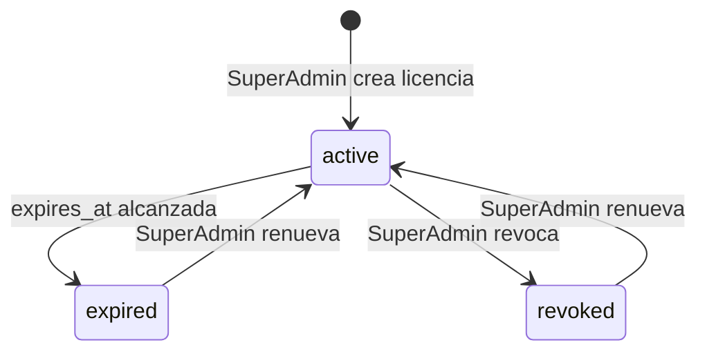

# Manual de Programador — Sistema de Manifestación de Valor Exterior (MVE)

> **Versión:** 1.0  
> **Última actualización:** Junio 2026  
> **Stack:** Laravel 12 · PHP 8.2 · SQLite · Tailwind CSS 3 · Alpine.js · Vite  
> **Propósito:** Documentación técnica integral para desarrolladores que mantienen o extienden el sistema.

---

## Tabla de Contenido

1. [Introducción y Visión General](#1-introducción-y-visión-general)
2. [Arquitectura del Sistema](#2-arquitectura-del-sistema)
3. [Modelo de Datos](#3-modelo-de-datos)
4. [Guía de Instalación y Configuración](#4-guía-de-instalación-y-configuración)
5. [Estructura del Proyecto](#5-estructura-del-proyecto)
6. [Referencia de Controllers](#6-referencia-de-controllers)
7. [Referencia de Services](#7-referencia-de-services)
8. [Integración VUCEM](#8-integración-vucem)
9. [Guías de Troubleshooting](#9-guías-de-troubleshooting)
10. [Seguridad y Buenas Prácticas](#10-seguridad-y-buenas-prácticas)
11. [Modelo de Licencias](#11-modelo-de-licencias)
12. [Pruebas y Calidad](#12-pruebas-y-calidad)
13. [Referencia de Models](#13-referencia-de-models)
14. [Middleware, Traits y Excepciones](#14-middleware-traits-y-excepciones)
15. [Comandos Artisan y Proveedores](#15-comandos-artisan-y-proveedores)
16. [Sistema de Correos (Mailables)](#16-sistema-de-correos-mailables)
17. [Frontend — Vistas y Componentes](#17-frontend--vistas-y-componentes)

---

# 1. Introducción y Visión General

## 1.1 Propósito del Sistema

El Sistema de **Manifestación de Valor Exterior (MVE)** es una aplicación web diseñada para que agentes aduanales, importadores y exportadores mexicanos puedan generar, firmar electrónicamente y enviar **Manifestaciones de Valor de Exportación** a la **Ventanilla Única de Comercio Exterior Mexicana (VUCEM)** del SAT.

El sistema actúa como un intermediario que:

1. Toma datos de operaciones de comercio exterior (pedimentos, COVEs, facturas).
2. Construye la estructura XML requerida por VUCEM.
3. Genera la **cadena original** con el formato pipe-delimited que exige el SAT.
4. La **firma electrónicamente** usando la e.firma (FIEL) del contribuyente.
5. La envía al web service SOAP de VUCEM.
6. Recibe y almacena el **acuse** sellado por el SAT.

## 1.2 Glosario de Términos

| Término | Definición |
|---|---|
| **MVE** | Manifestación de Valor de Exportación. Declaración electrónica del valor en aduana de mercancías de exportación. |
| **COVE** | Comprobante de Valor Electrónico. Documento que ampara el valor declarado de las mercancías. |
| **eDocument** | Identificador alfanumérico (ej. `COVE257VFW2I7` o `0433250D59FS5`) que VUCEM asigna a cada documento electrónico. |
| **VUCEM** | Ventanilla Única de Comercio Exterior Mexicana. Plataforma del SAT para trámites de comercio exterior. |
| **Archivo M** | Archivo de texto con formato de registros fijos (códigos 500, 501, 505, 506, 507, 551, 554, 556) que contiene los datos de un pedimento aduanal. También conocido como "pedimento digital". |
| **FIEL / e.firma** | Firma Electrónica Avanzada del SAT. Conjunto de certificado `.cer`, llave privada `.key` y contraseña que permite firmar electrónicamente documentos. |
| **Acuse** | Documento PDF sellado que VUCEM devuelve como comprobante de recepción de una MVE. |
| **Pedimento** | Documento aduanal que ampara la entrada o salida de mercancías del territorio nacional. |
| **SOAP** | Protocolo de comunicación usado por los web services de VUCEM. |
| **WSSE** | Web Services Security. Estándar de seguridad usado en los headers SOAP de VUCEM (UsernameToken + e.firma). |

## 1.3 Stack Tecnológico

| Componente | Tecnología | Versión |
|---|---|---|
| Backend | Laravel (PHP) | 12.x / PHP 8.2+ |
| Base de datos | SQLite (default), MySQL compatible | — |
| Frontend | Blade + Tailwind CSS + Alpine.js | Tailwind 3.x / Alpine 3.x |
| Build | Vite + Laravel Vite Plugin | 7.x |
| PDF | DomPDF, FPDF, FPDI | — |
| Firma electrónica | PhpCfdi/credentials + xmlseclibs | — |
| Validación PDF | Ghostscript (dependencia externa) | — |
| Correo | Microsoft Graph API | — |
| Tests | Pest PHP | 3.x |

## 1.4 Dependencias Externas Críticas

| Dependencia | Propósito | ¿Opcional? |
|---|---|---|
| **Ghostscript** | Validar y convertir PDFs a PDF/A-1b compatible VUCEM | Sí (solo para validación PDF) |
| **Microsoft Graph** | Envío de correos electrónicos (notificaciones, soporte) | Sí (fallback a `log` mailer) |
| **OpenSSL** | Firma electrónica con FIEL | No |
| **cURL** | Llamadas SOAP a VUCEM | No |
| **PhpCfdi** | Lectura de certificados FIEL y generación de firmas | No |

---

# 2. Arquitectura del Sistema

## 2.1 Diagrama de Capas

```
┌─────────────────────────────────────────────────────────────────────┐
│                         FRONTEND (Blade + Alpine)                    │
│  welcome │ dashboard │ mve.create │ mve.edit │ admin │ profile │    │
└───────────────────────────────┬─────────────────────────────────────┘
                                │ HTTP
┌───────────────────────────────▼─────────────────────────────────────┐
│                         ROUTES (web.php)                             │
│  Middleware: auth │ role │ license │ verified                        │
└───────────────────────────────┬─────────────────────────────────────┘
                                │
┌───────────────────────────────▼─────────────────────────────────────┐
│                      CONTROLLERS (19)                                │
│  MveController · ApplicantController · EDocumentConsultaController  │
│  DigitalizacionController · DocumentUploadController                 │
│  LicenseController · UserManagementController · TicketController     │
│  AdminSettingsController · AdminStatsController · etc.               │
└───────┬───────────────────────┬─────────────────────────┬───────────┘
        │                       │                         │
┌───────▼────────┐   ┌──────────▼──────────┐   ┌──────────▼──────────┐
│   SERVICES      │   │      MODELS         │   │      MAILS          │
│  (11 services)  │   │    (18 models)      │   │   (10 mailables)    │
│                 │   │                     │   │                     │
│ MveSignService  │   │ MvClientApplicant   │   │ MveSubmitted        │
│ EFirmaService   │   │ MvDatosManifestacion│   │ LicenseAssigned     │
│ ConsultarEdo    │   │ MvInformacionCove   │   │ WelcomeNewUser      │
│ DigitalizarDoc  │   │ MvDocumentos        │   │ SupportRequest      │
│ DocumentUpload  │   │ MvAcuse             │   │ AnnouncementMail    │
│ MvVucemSoap     │   │ License · User      │   │ TicketResponseMail  │
│ VucemDiagnostic │   │ SupportTicket · Faq │   │ SealExpiryWarning   │
│                 │   │ VucemErrorLog · etc │   │ ApplicantAdded      │
└───────┬────────┘   └──────────┬──────────┘   └─────────────────────┘
        │                       │
┌───────▼───────────────────────▼──────────────────────────────────────┐
│                        BASE DE DATOS (SQLite)                        │
│  mv_client_applicants · mv_datos_manifestacion · mv_informacion_cove│
│  mv_documentos · mv_acuses · edocuments_registrados                  │
│  licenses · support_tickets · announcements · faqs · vucem_error_logs│
└──────────────────────────────────────────────────────────────────────┘
                                │
┌───────────────────────────────▼──────────────────────────────────────┐
│               INTEGRACIONES EXTERNAS (SOAP / API)                    │
│  ┌─────────────────┐  ┌─────────────────┐  ┌──────────────────┐    │
│  │ VUCEM - MV Envío │  │ VUCEM - COVE    │  │ Microsoft Graph  │    │
│  │ IngresoManifes   │  │ ConsultarEdoc   │  │ (Correo)         │    │
│  │ tacionService    │  │ ConsultarResp   │  └──────────────────┘    │
│  └─────────────────┘  │ uestaCove       │                           │
│                        └─────────────────┘                           │
│  ┌─────────────────┐  ┌─────────────────┐                           │
│  │ VUCEM - Acuses  │  │ Ghostscript      │                           │
│  │ ConsultaAcuses  │  │ (PDF/A-1b)       │                           │
│  └─────────────────┘  └─────────────────┘                           │
└──────────────────────────────────────────────────────────────────────┘
```

## 2.2 Flujo de Autenticación y Autorización

### 2.2.1 Middleware chain

```
Request → web middleware → auth → verified → license → role (opcional) → Controller
```

| Middleware | Propósito |
|---|---|
| `auth` | Usuario autenticado (Laravel Breeze) |
| `verified` | Email verificado (verification) |
| `license` | Licencia activa y no vencida |
| `role:SuperAdmin,Admin` | Control de acceso por rol |

### 2.2.2 Roles del Sistema

```
SuperAdmin → Admin → Usuario
```

| Rol | Creación de usuarios | Visibilidad de solicitantes | Licencia requerida |
|---|---|---|---|
| **SuperAdmin** | Crea Admins, SuperAdmins y Usuarios | Solo sus propios solicitantes (o de su empresa) | No aplica |
| **Admin** | Crea solo Usuarios | Solo los que él creó (o legacy por email) | Sí |
| **Usuario** | Ninguno | Solo los asignados explícitamente | Sí |

### 2.2.3 Restricción empresarial

Los SuperAdmin y Admin operan dentro del contexto de su `company`. Un SuperAdmin **nunca** ve solicitantes de otra empresa, incluso teniendo el rol más alto. La lógica de filtro se replica en:

- `routes/web.php` (dashboard, pending-count)
- `MveController::getAccessibleApplicants()`
- `ApplicantController::index()`
- `EDocumentConsultaController::checkCredentials()`

## 2.3 Flujo de Ciclo de Vida Completo de una MVE

### Diagrama de secuencia: Creación → Envío → Acuse

```
Usuario              Frontend              MveController          Services           VUCEM
   │                     │                      │                    │                 │
   │  1. Selecciona      │                      │                    │                 │
   │  solicitante        │                      │                    │                 │
   ├─────────────────────►  GET /mve/select-    │                    │                 │
   │                     │  applicant           │                    │                 │
   │                     ├──────────────────────► getAccessible      │                 │
   │                     │                      │ Applicants()       │                 │
   │                     ◄──────────────────────┤                    │                 │
   │  Vista con lista    │                      │                    │                 │
   │  de solicitantes    │                      │                    │                 │
   ◄─────────────────────┤                      │                    │                 │
   │                     │                      │                    │                 │
   │  2. Elige modo      │                      │                    │                 │
   │  (manual/archivo)   │                      │                    │                 │
   ├─────────────────────►  GET /mve/manual/    │                    │                 │
   │                     │  {applicant}          │                    │                 │
   │                     ├──────────────────────► canAccessApplicant │                 │
   │                     │                      │  → createManual()  │                 │
   │  Vista formulario   ◄──────────────────────┤                    │                 │
   │  3 pasos            │                      │                    │                 │
   ◄─────────────────────┤                      │                    │                 │
   │                     │                      │                    │                 │
   │  3. Guarda Paso 1   │                      │                    │                 │
   │  (Datos Grales)     │                      │                    │                 │
   ├─────────────────────►  POST /mve/save-     │                    │                 │
   │                     │  datos-manifestacion │                    │                 │
   │                     ├──────────────────────► Validación          │                 │
   │                     │                      │ → save/update      │                 │
   │                     │                      │ → status='borrador' │                 │
   │  {mve_id} ◄─────────◄──────────────────────┤                    │                 │
   │                     │                      │                    │                 │
   │  4. Guarda Paso 2   │                      │                    │                 │
   │  (Información COVE) │                      │                    │                 │
   ├─────────────────────►  POST /mve/save-     │                    │                 │
   │                     │  informacion-cove    │                    │                 │
   │                     ├──────────────────────► Validación          │                 │
   │                     │                      │ → save/update      │                 │
   ◄─────────────────────◄──────────────────────┤                    │                 │
   │                     │                      │                    │                 │
   │  5. Guarda Paso 3   │                      │                    │                 │
   │  (Documentos)       │                      │                    │                 │
   ├─────────────────────►  POST /mve/save-     │                    │                 │
   │                     │  documentos          │                    │                 │
   │                     ├──────────────────────► Validación          │                 │
   │                     │                      │ → save/update      │                 │
   ◄─────────────────────◄──────────────────────┤                    │                 │
   │                     │                      │                    │                 │
   │  6. Finaliza        │                      │                    │                 │
   │                     ├──────────────────────► checkCompletion()  │                 │
   │                     │                      │ → saveFinalManif   │                 │
   │                     │                      │ estacion()         │                 │
   │                     │                      │ → status='guardado'│                 │
   │                     │                      │                    │                 │
   │  7. Firma y Envía   │                      │                    │                 │
   ├─────────────────────►  POST /mve/firmar-   │                    │                 │
   │                     │  enviar/{applicant}  │                    │                 │
   │                     ├──────────────────────► firmarYEnviarAjax() │                 │
   │                     │                      ├────►Manifestacion  │                 │
   │                     │                      │     ValorService   │                 │
   │                     │                      │     → buildCadena  │                 │
   │                     │                      │       Original()   │                 │
   │                     │                      │                    │                 │
   │                     │                      ├────► EFirmaService │                 │
   │                     │                      │     → generarFirma │                 │
   │                     │                      │       Electronica  │                 │
   │                     │                      │       ConArchivos() │                 │
   │                     │                      │                    │                 │
   │                     │                      ├────► MveSignService│                 │
   │                     │                      │     → buildSoap    │                 │
   │                     │                      │       Envelope()   │                 │
   │                     │                      │     → enviarAVucem()│──► SOAP Request│
   │                     │                      │                    │◄── SOAP Response│
   │                     │                      │                    │                 │
   │                     │                      │  procesarRespuesta │                 │
   │                     │                      │  → MvAcuse::create │                 │
   │                     │                      │  → status='enviado'│                 │
   │  {success,folio} ◄──◄──────────────────────┤                    │                 │
   │                     │                      │                    │                 │
   │  8. Consulta acuse  │                      │                    │                 │
   ├─────────────────────►  GET /mve/acuse/     │                    │                 │
   │                     │  {manifestacion}      │                    │                 │
   │                     ├──────────────────────► showAcuse()        │                 │
   │                     │                      │ → consultarMani    │                 │
   │                     │                      │   festacion()      │──► SOAP Consulta│
   │  Vista con PDF      ◄──────────────────────┤                    │◄── SOAP Response│
   │  y XML              │                      │                    │                 │
   ◄─────────────────────┤                      │                    │                 │
```

## 2.4 Decisiones Arquitectónicas Clave

| Decisión | Justificación |
|---|---|
| **Guardado por secciones** | El formulario MVE es extenso (3 pasos). Guardar sección por sección permite al usuario salir y retomar sin perder datos. |
| **Status `'borrador'` al editar** | Cada vez que se edita cualquier sección, el status vuelve a `'borrador'` para evitar que se firme una versión con cambios sin revisar. |
| **Validación XML antes de firmar** | La firma es costosa (criptografía). Validar primero la estructura evita desperdiciar tiempo si los datos tienen errores que VUCEM rechazaría. |
| **Archivos temporales en `sys_get_temp_dir()`** | Las librerías OpenSSL requieren rutas de archivo físico, no streams de memoria. Se limpian en bloque `finally`. |
| **Sin `cascade` en migraciones** | La eliminación manual permite controlar orden y agregar lógica adicional (ej. eliminar archivos físicos antes de borrar el registro). |
| **SQLite como DB default** | Simplicidad de setup. Los datos se encriptan a nivel de aplicación, no de BD. |

---

# 3. Modelo de Datos

## 3.1 Diagrama Entidad-Relación

El diagrama completo en formato DBML está disponible en `docs/DIAGRAMA_BD.dbml`. A continuación se describen todas las tablas y sus relaciones.

## 3.2 Catálogo de Tablas

### 3.2.1 Core — Usuarios

#### `users`

| Columna | Tipo | Descripción |
|---|---|---|
| `id` | bigint PK | — |
| `full_name` | varchar(255) | Nombre completo |
| `email` | varchar(255) UNIQUE | Correo electrónico (login) |
| `username` | varchar(255) UNIQUE | Nombre de usuario (login alternativo) |
| `password` | varchar(255) | Hash bcrypt |
| `role` | varchar(255) | `SuperAdmin` \| `Admin` \| `Usuario` |
| `company` | varchar(255) nullable | Empresa a la que pertenece |
| `rfc` | text nullable | RFC del usuario |
| `max_users` | integer default 5 | Límite de usuarios que puede crear |
| `max_applicants` | integer default 10 | Límite de solicitantes que puede gestionar |
| `load_edocs_from_m` | boolean default true | Si debe cargar eDocuments al parsear Archivo M |
| `created_by` | varchar(255) nullable | FK lógica → `users.email` de quien lo creó |

### 3.2.2 Módulo MVE — Solicitantes

#### `mv_client_applicants`

Almacena los importadores/exportadores que serán declarados en las MVE. Contiene las **credenciales VUCEM encriptadas**.

| Columna | Tipo | Encriptado | Descripción |
|---|---|---|---|
| `id` | bigint PK | — | — |
| `user_email` | varchar(255) FK→users.email | — | Dueño del solicitante (legacy) |
| `created_by_user_id` | bigint nullable FK→users.id | — | Usuario que lo creó (nuevo sistema) |
| `applicant_rfc` | text | Sí | RFC del solicitante |
| `business_name` | text | Sí | Razón social |
| `applicant_email` | text nullable | Sí | Correo del solicitante |
| `vucem_key_file` | longtext nullable | Sí | Archivo .key en base64 |
| `vucem_cert_file` | longtext nullable | Sí | Archivo .cer en base64 |
| `vucem_cert_vigencia` | date nullable | — | Vigencia del certificado |
| `seal_expiry_notified` | boolean default false | — | Si ya se notificó vencimiento |
| `vucem_password` | text nullable | Sí | Contraseña del sello |
| `vucem_webservice_key` | text nullable | Sí | Clave Web Service VUCEM |
| `privacy_consent` | boolean default false | — | Aceptó aviso de privacidad |
| `privacy_consent_at` | timestamp nullable | — | Fecha de aceptación |

#### `mv_applicant_user_assignments`

Tabla pivote para asignación explícita de solicitantes a usuarios.

| Columna | Tipo | Descripción |
|---|---|---|
| `id` | bigint PK | — |
| `applicant_id` | bigint FK→mv_client_applicants.id | Solicitante |
| `user_id` | bigint FK→users.id | Usuario asignado |
| `created_at` | datetime | — |
| `updated_at` | datetime | — |

**Índice único:** `(applicant_id, user_id)`

### 3.2.3 Módulo MVE — Manifestación

#### `mv_datos_manifestacion`

Datos principales de la Manifestación de Valor (Paso 1 del formulario).

| Columna | Tipo | Encriptado | Descripción |
|---|---|---|---|
| `id` | bigint PK | — | — |
| `applicant_id` | bigint FK→mv_client_applicants.id | — | Solicitante |
| `created_by_user_id` | bigint nullable FK→users.id | — | Creador |
| `folio_interno` | varchar(20) UNIQUE nullable | — | Folio interno MVE-YYYY-XXXXXXXX |
| `status` | enum | — | `borrador` \| `completado` \| `guardado` \| `enviado` \| `rechazado` |
| `rfc_importador` | text nullable | Sí | RFC del importador |
| `metodo_valoracion` | text nullable | Sí | Método de valoración |
| `existe_vinculacion` | text nullable | Sí | ¿Existe vinculación? |
| `pedimento` | text nullable | Sí | Número de pedimento |
| `patente` | text nullable | Sí | Patente aduanal |
| `aduana` | text nullable | Sí | Clave de aduana |
| `persona_consulta` | text nullable | Sí | JSON con personas consultadas |

**Generación de `folio_interno`:** Se genera automáticamente en el evento `creating` del modelo con el formato `MVE-YYYY-XXXXXXXX` donde `XXXXXXXX` son 8 caracteres hexadecimales aleatorios.

#### `mv_informacion_cove`

Información de COVE y Valor en Aduana (Paso 2 del formulario). Almacena datos complejos como JSON encriptado.

| Columna | Tipo | Encriptado | Descripción |
|---|---|---|---|
| `id` | bigint PK | — | — |
| `applicant_id` | bigint FK→mv_client_applicants.id | — | Solicitante |
| `datos_manifestacion_id` | bigint nullable FK→mv_datos_manifestacion.id | — | MVE padre |
| `status` | enum | — | Mismo que mv_datos_manifestacion |
| `informacion_cove` | text nullable | Sí | JSON: array de COVEs con pedimentos, valoración |
| `pedimentos` | text nullable | Sí | JSON: pedimentos (formato legacy) |
| `precio_pagado` | text nullable | Sí | JSON: precio pagado (legacy) |
| `precio_por_pagar` | text nullable | Sí | JSON: precio por pagar (legacy) |
| `compenso_pago` | text nullable | Sí | JSON: compensación de pago (legacy) |
| `incrementables` | text nullable | Sí | JSON: incrementables (legacy) |
| `decrementables` | text nullable | Sí | JSON: decrementables (legacy) |
| `valor_en_aduana` | text nullable | Sí | JSON: totales calculados |

#### `mv_documentos`

Documentos de la Manifestación (Paso 3 del formulario).

| Columna | Tipo | Descripción |
|---|---|---|
| `id` | bigint PK | — |
| `applicant_id` | bigint FK→mv_client_applicants.id | Solicitante |
| `datos_manifestacion_id` | bigint nullable FK→mv_datos_manifestacion.id | MVE padre |
| `status` | enum | Mismo que mv_datos_manifestacion |
| `documentos` | text nullable | JSON encriptado: array de eDocuments |
| `document_name` | varchar(255) nullable | Nombre del documento (subida manual) |
| `tipo_documento` | varchar(255) nullable | Tipo de documento |
| `folio_edocument` | varchar(30) nullable | Folio eDocument |
| `original_filename` | varchar(255) nullable | Nombre original del archivo |
| `file_size` | bigint nullable | Tamaño en bytes |
| `is_vucem_compliant` | boolean default false | ¿Cumple requisitos VUCEM? |
| `was_converted` | boolean default false | ¿Fue convertido? |
| `uploaded_by` | varchar(255) nullable | Email de quien subió |
| `file_content_base64` | longtext nullable | Contenido del PDF en base64 |
| `mime_type` | varchar(255) nullable | Tipo MIME |

### 3.2.4 Módulo MVE — Acuses

#### `mv_acuses`

Almacena la respuesta de VUCEM después de un envío exitoso.

| Columna | Tipo | Descripción |
|---|---|---|
| `id` | bigint PK | — |
| `applicant_id` | bigint FK→mv_client_applicants.id | Solicitante |
| `datos_manifestacion_id` | bigint nullable FK→mv_datos_manifestacion.id | MVE relacionada |
| `created_by_user_id` | bigint nullable FK→users.id | Usuario que envió |
| `folio_interno` | varchar(30) nullable | Folio interno de la MVE |
| `folio_manifestacion` | varchar(50) UNIQUE | Folio asignado por VUCEM (MNVA...) |
| `numero_pedimento` | varchar(20) nullable | Número de pedimento |
| `numero_cove` | varchar(20) nullable | Número de COVE |
| `xml_enviado` | text | XML SOAP que se envió |
| `xml_respuesta` | text | XML de respuesta de VUCEM |
| `xml_declaracion` | text nullable | XML de declaración (consulta posterior) |
| `acuse_pdf` | longtext nullable | PDF de acuse en base64 |
| `status` | varchar(50) default 'ENVIADO' | Estado del acuse |
| `mensaje_vucem` | text nullable | Mensaje de error de VUCEM |
| `fecha_envio` | timestamp | Fecha de envío |
| `fecha_respuesta` | timestamp nullable | Fecha de respuesta |

### 3.2.5 Módulo MVE — eDocuments Registrados

#### `edocuments_registrados`

Cache local de consultas a VUCEM para evitar consultas duplicadas.

| Columna | Tipo | Descripción |
|---|---|---|
| `id` | bigint PK | — |
| `applicant_id` | bigint nullable FK→mv_client_applicants.id | Solicitante |
| `folio_edocument` | varchar(30) UNIQUE | Folio eDocument |
| `numero_operacion` | varchar(30) nullable | Número de operación |
| `tipo_documento` | varchar(10) nullable | Tipo de documento |
| `nombre_documento` | varchar(100) nullable | Nombre del documento |
| `existe_en_vucem` | boolean default false | ¿Existe en VUCEM? |
| `fecha_ultima_consulta` | timestamp nullable | Última consulta |
| `response_code` | varchar(50) nullable | Código de respuesta |
| `response_message` | varchar(255) nullable | Mensaje de respuesta |
| `cove_data` | json nullable | Datos completos del COVE |

### 3.2.6 Módulo — Licencias

#### `licenses`

Gestiona el acceso de Admins al sistema por tiempo limitado.

| Columna | Tipo | Descripción |
|---|---|---|
| `id` | bigint PK | — |
| `license_key` | varchar(32) UNIQUE | Clave única generada |
| `admin_id` | bigint FK→users.id | Admin asignado |
| `duration_type` | varchar(255) | `1min` \| `1month` \| `6months` \| `1year` |
| `starts_at` | timestamp nullable | Inicio de vigencia |
| `expires_at` | timestamp nullable | Fin de vigencia |
| `status` | varchar(255) default 'active' | `active` \| `expired` \| `revoked` |
| `expiry_notified` | boolean default false | ¿Se notificó el vencimiento? |
| `created_by` | bigint FK→users.id | SuperAdmin que la creó |
| `notes` | text nullable | Notas |

### 3.2.7 Módulo — Soporte Técnico

#### `support_tickets`

| Columna | Tipo | Descripción |
|---|---|---|
| `id` | bigint PK | — |
| `user_id` | bigint FK→users.id | Usuario que reporta |
| `category` | varchar(100) | Categoría |
| `subject` | varchar(255) | Asunto |
| `description` | text | Descripción |
| `status` | varchar(255) default 'open' | `open` \| `in_progress` \| `closed` \| `cancelled` |

#### `support_ticket_messages`

| Columna | Tipo | Descripción |
|---|---|---|
| `id` | bigint PK | — |
| `ticket_id` | bigint FK→support_tickets.id | Ticket padre |
| `sender_id` | bigint FK→users.id | Quien responde |
| `body` | text | Contenido |
| `is_support_response` | boolean default false | Si es respuesta de soporte |

#### `support_ticket_attachments`

| Columna | Tipo | Descripción |
|---|---|---|
| `id` | bigint PK | — |
| `message_id` | bigint FK→support_ticket_messages.id | Mensaje padre |
| `original_name` | varchar(255) | Nombre original |
| `stored_name` | varchar(255) | Nombre en disco |
| `mime_type` | varchar(100) | Tipo MIME |
| `size` | bigint default 0 | Tamaño |

### 3.2.8 Módulo — Anuncios, Manuales y FAQ

#### `announcements`

| Columna | Tipo | Descripción |
|---|---|---|
| `id` | bigint PK | — |
| `title` | varchar(255) | Título |
| `body` | text | Contenido |
| `created_by` | bigint FK→users.id | Creador |

#### `announcement_reads`

| Columna | Tipo | Descripción |
|---|---|---|
| `id` | bigint PK | — |
| `announcement_id` | bigint FK→announcements.id | Anuncio |
| `user_id` | bigint FK→users.id | Usuario |
| `read_at` | timestamp nullable | |
| | | **Índice único:** `(announcement_id, user_id)` |

#### `user_manuals`

| Columna | Tipo | Descripción |
|---|---|---|
| `id` | bigint PK | — |
| `version` | varchar(50) | Versión del manual |
| `filename` | varchar(255) | Nombre en disco (`storage/app/manuals/`) |
| `original_name` | varchar(255) | Nombre original |
| `uploaded_by` | bigint FK→users.id | Quién lo subió |

#### `faqs`

| Columna | Tipo | Descripción |
|---|---|---|
| `id` | bigint PK | — |
| `question` | text | Pregunta |
| `answer` | text | Respuesta |
| `sort_order` | integer default 0 | Orden de aparición |
| `is_published` | boolean default true | Publicado |
| `created_by` | bigint nullable FK→users.id | Creador |

#### `faq_attachments`

| Columna | Tipo | Descripción |
|---|---|---|
| `id` | bigint PK | — |
| `faq_id` | bigint FK→faqs.id | FAQ padre |
| `original_name` | varchar(255) | Nombre original |
| `stored_name` | varchar(255) | Nombre en disco |
| `mime_type` | varchar(100) | Tipo MIME |
| `size` | bigint | Tamaño |

### 3.2.9 Tablas de Sistema / Log

#### `app_settings`

| Columna | Tipo | Descripción |
|---|---|---|
| `id` | bigint PK | — |
| `key` | varchar(255) UNIQUE | Clave |
| `value` | text nullable | Valor |

Claves utilizadas: `aviso_privacidad_sellos`, `aviso_privacidad_completo`, `condiciones_uso`, `banner_message`, `banner_enabled`.

#### `vucem_error_logs`

| Columna | Tipo | Descripción |
|---|---|---|
| `id` | bigint PK | — |
| `user_id` | bigint nullable FK→users.id | Usuario |
| `applicant_id` | bigint nullable FK→mv_client_applicants.id | Solicitante |
| `servicio` | varchar(30) | `MV_ENVIO` \| `MV_CONSULTA` \| `DIGITALIZACION` \| `DIGITALIZACION_CONSULTA` |
| `tipo_error` | varchar(50) | `TIMEOUT` \| `CONNECTION_REFUSED` \| `SSL_ERROR` \| `DNS_ERROR` \| `CURL_ERROR` |
| `curl_error_raw` | text nullable | Error crudo de cURL |

## 3.3 Relaciones Clave

```
users (1) ──< mv_client_applicants (created_by_user_id)
users (1) ──< mv_client_applicants (user_email)
users (1) ──< mv_applicant_user_assignments >── (1) mv_client_applicants
users (1) ──< mv_datos_manifestacion (created_by_user_id)
users (1) ──< licenses (admin_id)
users (1) ──< support_tickets (user_id)
users (1) ──< announcements (created_by)

mv_client_applicants (1) ──< mv_datos_manifestacion (applicant_id)
mv_datos_manifestacion (1) ──< mv_informacion_cove (datos_manifestacion_id)
mv_datos_manifestacion (1) ──< mv_documentos (datos_manifestacion_id)
mv_datos_manifestacion (1) ──< mv_acuses (datos_manifestacion_id)
```

## 3.4 Estrategia de Encriptación

El sistema utiliza **dos mecanismos** de encriptación:

### 3.4.1 Encriptación automática con `casts`

En `MvClientApplicant`, los campos sensibles usan el cast `encrypted` de Laravel:

```php
protected $casts = [
    'applicant_rfc'        => 'encrypted',
    'business_name'        => 'encrypted',
    'applicant_email'      => 'encrypted',
    'vucem_key_file'       => 'encrypted',
    'vucem_cert_file'      => 'encrypted',
    'vucem_password'       => 'encrypted',
    'vucem_webservice_key' => 'encrypted',
];
```

Laravel encripta automáticamente al guardar (`set`) y desencripta al leer (`get`).

### 3.4.2 Encriptación manual con `Crypt::encryptString`

En `MvDatosManifestacion`, los campos se encriptan manualmente usando accesors/mutators:

```php
protected function rfcImportador(): Attribute
{
    return Attribute::make(
        get: fn ($value) => $value ? Crypt::decryptString($value) : null,
        set: fn ($value) => $value ? Crypt::encryptString(strtoupper($value)) : null,
    );
}
```

La diferencia con el cast `encrypted` es que permite aplicar transformaciones adicionales (ej. `strtoupper`) antes de encriptar.

### 3.4.3 Campos encriptados por tabla

| Tabla | Campos encriptados |
|---|---|
| `mv_client_applicants` | applicant_rfc, business_name, applicant_email, vucem_key_file, vucem_cert_file, vucem_password, vucem_webservice_key |
| `mv_datos_manifestacion` | rfc_importador, metodo_valoracion, existe_vinculacion, pedimento, patente, aduana, persona_consulta |
| `mv_informacion_cove` | informacion_cove, pedimentos, precio_pagado, precio_por_pagar, compenso_pago, incrementables, decrementables, valor_en_aduana |
| `mv_documentos` | documentos |

**Importante:** Los campos encriptados no pueden ser usados en cláusulas `WHERE`, `LIKE`, ni `ORDER BY` de SQL porque el motor de BD ve el texto cifrado, no el valor plano.

## 3.5 Migraciones

El proyecto contiene **33 migraciones**. La más importante es `2026_01_13_000000_create_all_mve_tables.php` que crea las 7 tablas del núcleo MVE en una sola migración consolidada. Las migraciones posteriores agregan tablas de soporte, licencias, anuncios, FAQs, logs de error y campos adicionales.

**Orden cronológico resumido:**

1. Migraciones base de Laravel (users, cache, jobs)
2. Tablas MVE (mv_client_applicants, mv_datos_manifestacion, mv_informacion_cove, mv_documentos, edocuments_registrados, mv_acuses)
3. Licencias + límites a usuarios
4. Soporte técnico (tickets, mensajes, adjuntos)
5. App settings, vigencia de certificados, folio interno
6. Asignación de usuarios a solicitantes
7. Manuales de usuario, anuncios, logs VUCEM
8. FAQs, declaración XML en acuses

---

# 4. Guía de Instalación y Configuración

## 4.1 Requisitos del Sistema

| Requisito | Versión Mínima | Notas |
|---|---|---|
| PHP | 8.2 | Con extensiones: bcmath, ctype, curl, dom, fileinfo, gd, json, mbstring, openssl, pdo, tokenimizer, xml, xmlwriter |
| Composer | 2.x | Gestor de dependencias PHP |
| Node.js | 18+ | Para build de assets con Vite |
| NPM | 9+ | Gestor de paquetes JS |
| Ghostscript | 9.50+ | Solo necesario para validación PDF VUCEM |
| SQLite | 3.x | Driver incluido en PHP |

### Extensiones PHP requeridas

```
bcmath, ctype, curl, dom, fileinfo, gd, json, libxml, mbstring,
openssl, pdo, pdo_sqlite, tokenizer, xml, xmlwriter, zip
```

## 4.2 Instalación Rápida

```bash
# 1. Clonar el repositorio
git clone <repo-url> manifestacion-valor
cd manifestacion-valor

# 2. Setup automático (crea .env, genera key, migra BD, compila assets)
composer run setup

# 3. Iniciar servidor de desarrollo
composer run dev
```

El comando `composer run setup` ejecuta:
1. `composer install` — instala dependencias PHP
2. Copia `.env.example` a `.env` si no existe
3. `php artisan key:generate` — genera APP_KEY
4. `php artisan migrate --force` — ejecuta migraciones
5. `npm install` — instala dependencias frontend
6. `npm run build` — compila assets con Vite

## 4.3 Configuración Manual

### 4.3.1 Variables de Entorno (`.env`)

```ini
# ─── Generales ───
APP_NAME=MVE
APP_ENV=local
APP_DEBUG=true
APP_URL=http://localhost

# ─── Base de Datos ───
DB_CONNECTION=sqlite
# Para MySQL:
# DB_CONNECTION=mysql
# DB_HOST=127.0.0.1
# DB_PORT=3306
# DB_DATABASE=mve
# DB_USERNAME=root
# DB_PASSWORD=

# ─── Sesión / Cache / Cola ───
SESSION_DRIVER=database
SESSION_ENCRYPT=true
QUEUE_CONNECTION=database
CACHE_STORE=database

# ─── Credenciales WSSE para eDocument (VUCEM) ───
VUCEM_EDOC_USERNAME=
VUCEM_EDOC_PASSWORD=
VUCEM_EDOC_USER_TOKEN_MODE=TEXT

# ─── Correo ───
MAIL_MAILER=log
# Para Microsoft Graph:
# MAIL_MAILER=microsoft-graph
SUPPORT_EMAIL=soporte@tuempresa.com

# ─── Flags de funcionalidad ───
VUCEM_SEND_MANIFESTATION_ENABLED=false
COVE_RECIBIR_ENABLED=false
PDF_DEBUG_ENABLED=false
```

### 4.3.2 Variables críticas de VUCEM

| Variable | Propósito | Valor default |
|---|---|---|
| `VUCEM_EDOC_USERNAME` | Usuario WSSE para servicio ConsultarEdocument | — |
| `VUCEM_EDOC_PASSWORD` | Contraseña WSSE para servicio ConsultarEdocument | — |
| `VUCEM_SEND_MANIFESTATION_ENABLED` | Habilita envío real a VUCEM | `false` |
| `COVE_RECIBIR_ENABLED` | ⚠️ Habilita Recepción de COVE (genera trámites reales) | `false` |
| `PDF_DEBUG_ENABLED` | Habilita rutas de debug PDF (SuperAdmin) | `false` |

### 4.3.3 Configuración VUCEM (`config/vucem.php`)

El archivo `config/vucem.php` centraliza toda la configuración de integración con VUCEM:

- **Endpoints SOAP** para cada servicio (MV Envío, MV Consulta, COVE Consulta, Acuses)
- **Rutas a WSDLs locales** (fallback cuando el WSDL remoto no está disponible)
- **Timeouts** de conexión (default 30s, configurable vía `VUCEM_SOAP_TIMEOUT`)
- **Flags de seguridad** (`cove_recibir_enabled`, `send_manifestation_enabled`)
- **Configuración de e.firma** (rutas a archivos .cer/.key)

### 4.3.4 Configuración de PDF Tools (`config/pdftools.php`)

Controla la validación y conversión de PDFs:

| Parámetro | Default | Descripción |
|---|---|---|
| `max_size_mb` | 4 | Tamaño máximo de PDF en MB |
| `max_pages` | 200 | Máximo de páginas |
| `ghostscript_path` | `gswin64c` | Ruta al ejecutable de Ghostscript |
| `gs_timeout` | 120 | Timeout para Ghostscript en segundos |

## 4.4 Primeros Pasos Post-Instalación

1. **Crear un SuperAdmin**: El primer usuario debe crearse con rol `SuperAdmin` directamente en la BD o vía seeder.
2. **Configurar catálogos VUCEM**: Verificar `app/Constants/VucemCatalogs.php` contra la documentación oficial del SAT.
3. **Probar conectividad**: Usar la ruta `/mve/verificar-red` (autenticado) para probar conectividad con VUCEM.
4. **Cargar WSDLs locales**: Los archivos WSDL en `wsdl/vucem/` deben estar actualizados.

## 4.5 Comandos Útiles

```bash
# Iniciar servidor + queue + logs + Vite (desarrollo)
composer run dev

# Ejecutar tests
composer run test

# Limpiar configuración en caché
php artisan config:clear

# Ver estado de la cola
php artisan queue:status

# Logs en tiempo real
php artisan pail
```

---

# 5. Estructura del Proyecto

## 5.1 Árbol de Directorios (resumido)

```
├── app/
│   ├── Console/           # Comandos Artisan
│   ├── Constants/         # VucemCatalogs.php
│   ├── Exceptions/        # CoveConsultaException.php
│   ├── Http/
│   │   ├── Controllers/   # 19 controllers
│   │   │   ├── Admin/     # PdfDebugController.php
│   │   │   └── Auth/      # Login, Register, etc.
│   │   └── ...
│   ├── Mail/              # 10 mailables
│   ├── Models/            # 18 modelos Eloquent
│   ├── Policies/
│   ├── Providers/
│   ├── Services/          # 11 servicios
│   ├── Traits/            # VucemConnectivityHandler.php
│   └── View/
├── bootstrap/
├── config/
│   ├── app.php
│   ├── vucem.php          # Configuración VUCEM
│   ├── pdftools.php       # Configuración PDF
│   └── ...
├── database/
│   ├── migrations/        # 33 migraciones
│   ├── factories/
│   └── seeders/
├── docs/
│   ├── controllers.md     # Documentación existente
│   ├── DIAGRAMA_BD.dbml   # Diagrama BD
│   └── programmer/        # Este manual
├── mve_vucem/             # Esquemas XSD de VUCEM
│   └── vucem/
│       ├── COVE/
│       └── Manifestacion_Valor/
├── public/
│   ├── images/
│   └── index.php
├── resources/
│   ├── css/
│   ├── js/
│   └── views/             # Vistas Blade
│       ├── admin/
│       ├── applicants/
│       ├── auth/
│       ├── dashboard.blade.php
│       ├── digitalizacion/
│       ├── edocument/
│       ├── emails/
│       ├── faqs/
│       ├── layouts/
│       ├── legal/
│       ├── manuals/
│       ├── mve/           # Vistas principales del flujo MVE
│       ├── profile/
│       ├── tickets/
│       └── users/
├── routes/
│   ├── web.php            # Rutas principales
│   ├── auth.php           # Rutas de autenticación
│   └── console.php        # Rutas de consola
├── storage/
├── tests/
│   ├── Feature/
│   └── Unit/
├── wsdl/                  # WSDLs de VUCEM
│   └── vucem/
│       ├── COVE/
│       ├── IngresoManifestacionService.wsdl
│       └── IngresoManifestacionService.xsd
├── composer.json
├── package.json
├── tailwind.config.js
└── vite.config.js
```

## 5.2 Archivos y Directorios Clave

### `app/Constants/VucemCatalogs.php`

Contiene los catálogos oficiales de VUCEM utilizados en los formularios y en la validación de datos:

```php
class VucemCatalogs
{
    public static $tiposFigura = [
        'TIPFIG.AA' => 'Agente Aduanal',
        'TIPFIG.AP' => 'Apoderado Aduanal',
        // ...
    ];

    public static $incoterms = [
        'TIPINC.EXW' => 'EXW (En fábrica)',
        'TIPINC.FOB' => 'FOB (Franco a bordo)',
        // ...
    ];

    public static $aduanas = [
        '201' => 'Acapulco',
        '202' => 'Aeropuerto Internacional de la Cdad de México',
        // ... ~50 aduanas
    ];

    // También: metodosValoracion, incrementables, decrementables,
    // formasPago, tiposDocumentoMve
}
```

**Mantenimiento:** Estos catálogos deben actualizarse cuando el SAT publique cambios. No hay un mecanismo automático; la actualización es manual.

### `wsdl/` y `mve_vucem/`

Contienen los archivos WSDL y XSD de los servicios web de VUCEM. Se usan como:
- **Fallback local** cuando el WSDL remoto no está disponible.
- **Referencia offline** durante el desarrollo.
- **Validación estructural** de los XML generados.

| Archivo | Servicio |
|---|---|
| `wsdl/vucem/IngresoManifestacionService.wsdl` | Envío de MVE |
| `wsdl/vucem/COVE/ConsultarRespuestaCoveService.wsdl` | Consulta de COVE |
| `wsdl/vucem/COVE/edocument/ConsultarEdocument.wsdl` | Consulta de eDocuments |
| `wsdl/vucem/ACUSES/ConsultaAcusesServiceWS.wsdl` | Consulta de acuses PDF |
| `mve_vucem/vucem/Manifestacion_Valor/` | XSD de estructura de MVE |

---

# 6. Referencia de Controllers

> **Nota:** Este capítulo complementa el documento `docs/controllers.md` existente, que contiene una descripción detallada de cada controller (métodos, roles, partes críticas). Aquí se presenta una visión general de rutas, middlewares y tablas de referencia rápida.

## 6.1 Mapa de Rutas por Módulo

### Módulo MVE (Manifestación de Valor)

| Método | Ruta | Controller | Middleware | Propósito |
|---|---|---|---|---|
| GET | `/mve/select-applicant` | MveController@selectApplicant | auth, license | Seleccionar solicitante |
| GET | `/mve/manual/{applicant}` | MveController@createManual | auth, license | Formulario manual (3 pasos) |
| GET/POST | `/mve/archivo-m/{applicant}` | MveController@createWithFile | auth, license | Carga de Archivo M |
| POST | `/mve/save-datos-manifestacion/{applicant}` | MveController@saveDatosManifestacion | auth, license | Guardar paso 1 |
| POST | `/mve/save-informacion-cove/{applicant}` | MveController@saveInformacionCove | auth, license | Guardar paso 2 |
| POST | `/mve/save-valor-aduana/{applicant}` | MveController@saveValorAduana | auth, license | Guardar valor en aduana |
| POST | `/mve/save-documentos/{applicant}` | MveController@saveDocumentos | auth, license | Guardar paso 3 |
| POST | `/mve/digitalizar-documento/{applicant}` | MveController@digitalizarDocumento | auth, license | Digitalizar eDocument |
| POST | `/mve/consultar-operacion/{applicant}` | MveController@consultarOperacion | auth, license | Consultar folio eDocument |
| GET | `/mve/check-completion/{applicant}` | MveController@checkCompletion | auth, license | Verificar completitud |
| GET | `/mve/preview-data/{applicant}` | MveController@previewData | auth, license | Vista previa |
| POST | `/mve/save-final-manifestacion/{applicant}` | MveController@saveFinalManifestacion | auth, license | Finalizar MVE |
| POST | `/mve/firmar-enviar/{applicant}` | MveController@firmarYEnviarAjax | auth, license | Firmar y enviar a VUCEM |
| GET | `/mve/pendientes` | MveController@pendientes | auth, license | MVEs pendientes |
| GET | `/mve/completadas` | MveController@completadas | auth, license | MVEs completadas |
| DELETE | `/mve/borrar-borrador` | MveController@borrarBorrador | auth, license | Eliminar borrador |
| DELETE | `/mve/descartar/{applicant}` | MveController@descartarManifestacion | auth, license | Descartar MVE |
| GET | `/mve/acuse/{manifestacion}` | MveController@showAcuse | auth, license | Ver acuse |
| POST | `/mve/consultar/{acuse}` | MveController@consultarManifestacion | auth, license | Consultar VUCEM |

### Módulo COVE (Consulta)

| Método | Ruta | Controller | Middleware | Propósito |
|---|---|---|---|---|
| GET/POST | `/cove/consulta` | EDocumentConsultaController@index/consultar | auth, license | Consultar COVE |
| GET | `/cove/credenciales/{applicant}` | EDocumentConsultaController@checkCredentials | auth, license | Verificar credenciales |
| GET | `/cove/descargar/{token}` | EDocumentConsultaController@descargar | auth, license | Descargar resultado |
| POST | `/cove/acuse-pdf` | EDocumentConsultaController@consultarAcusePdf | auth, license | Consultar PDF acuse COVE |
| GET | `/cove/acuse-pdf/{token}` | EDocumentConsultaController@descargarAcusePdf | auth, license | Descargar PDF acuse COVE |

### Módulo Digitalización

| Método | Ruta | Controller | Middleware | Propósito |
|---|---|---|---|---|
| GET | `/digitalizacion` | DigitalizacionController@create | auth, license | Formulario de digitalización |
| POST | `/digitalizacion` | DigitalizacionController@store | auth, license | Procesar digitalización |
| POST | `/digitalizacion/{id}/consultar-operacion` | DigitalizacionController@consultarOperacion | auth, license | Consultar operación |

### Módulo Documentos

| Método | Ruta | Controller | Middleware | Propósito |
|---|---|---|---|---|
| POST | `/documents/upload` | DocumentUploadController@uploadDocument | auth, license | Subir PDF |
| GET | `/documents/applicant/{applicant}` | DocumentUploadController@getDocuments | auth, license | Listar documentos |
| DELETE | `/documents/{document}` | DocumentUploadController@deleteDocument | auth, license | Eliminar documento |
| GET | `/documents/download/{document}` | DocumentUploadController@downloadDocument | auth, license | Descargar documento |
| GET | `/documents/view/{document}` | DocumentUploadController@viewDocument | auth, license | Visualizar PDF |
| POST | `/documents/validate-preview` | DocumentUploadController@validatePdfPreview | auth, license | Validar PDF |

### Módulo Usuarios (Admin/SuperAdmin)

| Método | Ruta | Controller | Middleware | Propósito |
|---|---|---|---|---|
| GET | `/users` | UserManagementController@index | auth, role | Listar usuarios |
| GET | `/users/add` | UserManagementController@create | auth, role | Formulario creación |
| POST | `/users` | UserManagementController@store | auth, role | Crear usuario |
| GET | `/users/{user}/edit` | UserManagementController@edit | auth, role | Editar usuario |
| PUT | `/users/{user}` | UserManagementController@update | auth, role | Actualizar usuario |
| DELETE | `/users/{user}` | UserManagementController@destroy | auth, role | Eliminar usuario |

### Módulo Solicitantes

| Método | Ruta | Controller | Middleware | Propósito |
|---|---|---|---|---|
| GET | `/applicants` | ApplicantController@index | auth, license | Listar solicitantes |
| GET | `/applicants/create` | ApplicantController@create | auth, license | Formulario creación |
| POST | `/applicants` | ApplicantController@store | auth, license | Crear solicitante |
| GET | `/applicants/{applicant}` | ApplicantController@show | auth, license | Ver solicitante |
| GET | `/applicants/{applicant}/edit` | ApplicantController@edit | auth, license | Editar solicitante |
| PUT/PATCH | `/applicants/{applicant}` | ApplicantController@update | auth, license | Actualizar solicitante |
| DELETE | `/applicants/{applicant}` | ApplicantController@destroy | auth, license | Eliminar solicitante |

### Módulo Licencias (SuperAdmin)

| Método | Ruta | Controller | Middleware | Propósito |
|---|---|---|---|---|
| GET | `/admin/licenses` | LicenseController@index | auth, role | Listar licencias |
| POST | `/admin/licenses` | LicenseController@store | auth, role | Crear licencia |
| POST | `/admin/licenses/{license}/renew` | LicenseController@renew | auth, role | Renovar licencia |
| PATCH | `/admin/licenses/{license}/revoke` | LicenseController@revoke | auth, role | Revocar licencia |
| PATCH | `/admin/licenses/limits/{user}` | LicenseController@updateLimits | auth, role | Actualizar límites |

### Módulo Soporte Técnico

| Método | Ruta | Controller | Middleware | Propósito |
|---|---|---|---|---|
| POST | `/support/send` | SupportController@send | auth, license | Enviar solicitud |
| GET | `/tickets` | TicketController@index | auth, license | Listar tickets |
| GET | `/tickets/{ticket}` | TicketController@show | auth, license | Ver ticket |
| POST | `/tickets/{ticket}/respond` | TicketController@respond | auth, license | Responder ticket |
| PATCH | `/tickets/{ticket}/status` | TicketController@updateStatus | auth, license | Cambiar estado |
| POST | `/tickets/{ticket}/cancel` | TicketController@cancel | auth, license | Cancelar ticket |

### Módulo Administración (SuperAdmin)

| Método | Ruta | Controller | Middleware | Propósito |
|---|---|---|---|---|
| GET/PATCH | `/admin/settings` | AdminSettingsController | auth, role | Configuración global |
| GET | `/admin/estadisticas` | AdminStatsController@index | auth, role | Estadísticas |
| GET/POST | `/admin/pdf-debug` | PdfDebugController | auth, role, debug | Debug PDF |
| CRUD | `/faqs` | FaqController | auth + role | Preguntas frecuentes |
| CRUD | `/manuals` | UserManualController | auth + role | Manuales de usuario |
| POST/DELETE | `/announcements` | AnnouncementController | auth + role | Avisos generales |

## 6.2 Reglas de Visibilidad por Controller

Todos los controllers que listan o muestran datos de solicitantes implementan el mismo patrón de visibilidad:

| Rol | Visibilidad |
|---|---|
| **SuperAdmin** | Solo sus propios solicitantes (creados por él) o los de su `company` |
| **Admin** | Solo solicitantes creados por él (o legacy por `user_email`) |
| **Usuario** | Solo solicitantes explícitamente asignados (vía `mv_applicant_user_assignments`) |

Este patrón se replica en:
- `MveController::getAccessibleApplicants()`
- `ApplicantController::index()`
- `EDocumentConsultaController::checkCredentials()`
- Dashboard y ruta `/mve/pending-count`

---

# 7. Referencia de Services

## 7.1 ManifestacionValorService

**Archivo:** `app/Services/ManifestacionValorService.php`

**Responsabilidad:** Núcleo del dominio MVE. Construye la cadena original para la firma electrónica, parsea el Archivo M, y formatea datos según los estándares de VUCEM.

### Métodos principales

| Método | Propósito |
|---|---|
| `buildCadenaOriginal($applicant, $datosManifestacion, $informacionCove, $documentos)` | Construye la cadena pipe-delimited que se firma electrónicamente |
| `parseArchivoMForMV($content, $loadEdocs)` | Parsea un Archivo M (pedimento) en estructura de datos para MVE |
| `validateEdocumentFolio($folio)` | Valida formato de folio eDocument/COVE |
| `normalizeEdocumentFolio($folio)` | Normaliza folio (mayúsculas, sin espacios) |
| `formatVucemDate($date)` | Formatea fecha a `dd/mm/yyyy` para cadena original |
| `formatXmlDate($date)` | Formatea fecha a `Y-m-d\TH:i:s` para XML |
| `formatVucemNumber($value)` | Formatea número a 3 decimales, máximo 16 dígitos |

### Formato de Cadena Original

```
|RFC_IMPORTADOR|RFC_CONSULTA1|TIPO_FIGURA1|...|FOLIO_EDOC1|...|
|NUM_COVE|INCOTERM|VINCULACION|
|PEDIMENTO|PATENTE|ADUANA|...|
|FECHA_PAGO|TOTAL|TIPO_PAGO|[ESPECIFIQUE]|MONEDA|TIPO_CAMBIO|...|
|...|
|METODO_VALORACION|
|INCREMENTABLE|FECHA|IMPORTE|MONEDA|TIPO_CAMBIO|A_CARGO|...|
|...|
|TOTAL_PRECIO_PAGADO|TOTAL_PRECIO_POR_PAGAR|TOTAL_INCREMENTABLES|
|TOTAL_DECREMENTABLES|TOTAL_VALOR_ADUANA|
```

### Parseo de Archivo M

El método `parseArchivoMForMV()` procesa archivos de pedimento con formato de registros fijos (códigos de 3 dígitos):

| Código | Descripción | Datos extraídos |
|---|---|---|
| `500` | Encabezado | tipo_operacion, patente, pedimento, aduana |
| `501` | Datos generales | patente, pedimento, aduana, RFC importador, tipo_cambio, nombre, fecha_entrada, RFC agente |
| `505` | Proveedor/Comprador | número COVE, incoterm, id_fiscal, nombre |
| `506` | Fecha expedición | fecha por secuencia |
| `507` | Documentos | folios eDocument (solo tipo `ED`) |
| `551` | Mercancías/Vinculación | fracción, descripción, valores, vinculación |
| `554` | Incrementables | clave, importe |
| `556` | Decrementables | clave, importe |

## 7.2 MveSignService

**Archivo:** `app/Services/MveSignService.php`

**Responsabilidad:** Orquesta el proceso completo de firma y envío de una MVE a VUCEM.

### Flujo interno

```
firmarYEnviarManifestacion()
├── 1. ManifestacionValorService::buildCadenaOriginal()
├── 2. EFirmaService::generarFirmaElectronicaConArchivos()
├── 3. buildSoapEnvelopeFromXsd() → XML SOAP completo
└── 4. enviarAVucem() → cURL POST al endpoint VUCEM
    └── procesarRespuestaVucemXml() → MvAcuse::create()
```

### Construcción del SOAP Envelope

El método `buildSoapEnvelopeFromXsd()` construye el XML SOAP incluyendo:

- **Header WSSE:** Timestamp + UsernameToken (RFC + clave webservice)
- **Body:**
  - Firma electrónica (certificado + cadena original + sello digital)
  - RFC del importador/exportador
  - Datos de la manifestación (personas consultadas, eDocuments)
  - Información COVE (pedimentos, precios, incrementables, decrementables)
  - Valor en aduana (totales)

### Envío a VUCEM

Usa **cURL directo** (no SOAPClient de PHP) para tener control total sobre:

- Cifrado SSL (compatible con servidores VUCEM)
- Timeouts (120 segundos)
- Headers HTTP
- Manejo de errores de conectividad

La respuesta se procesa en `procesarRespuestaVucemXml()` que:
1. Limpia namespaces del XML (`preg_replace` de `</?(\w+):`).
2. Extrae `numeroOperacion`, `numeroManifestacion`, `acusePDF`.
3. Si hay folio real, crea `MvAcuse` y actualiza status a `enviado`.
4. Si hay error, actualiza status a `rechazado`.

## 7.3 EFirmaService

**Archivo:** `app/Services/EFirmaService.php`

**Responsabilidad:** Generar la firma electrónica usando la librería PhpCfdi.

### Método principal

```php
generarFirmaElectronicaConArchivos(
    string $cadenaOriginal,
    string $rfc,
    string $certPath,    // Ruta al .cer
    string $keyPath,     // Ruta al .key
    string $password     // Contraseña de la llave privada
): array
```

**Retorno:**
```php
[
    'success'     => true,
    'firma'       => 'base64 del sello digital',
    'certificado' => 'base64 del certificado',
    'cadena'      => 'cadena original usada',
]
```

### Dependencias

- `phpcfdi/credentials` — para leer certificados FIEL.
- `robrichards/xmlseclibs` — para operaciones de firma XML.
- OpenSSL (extensión de PHP).

## 7.4 ConsultarEdocumentService

**Archivo:** `app/Services/ConsultarEdocumentService.php`

**Responsabilidad:** Consultar un eDocument/COVE en VUCEM.

### Método principal

```php
consultar(
    string $rfcSolicitante,
    string $folioEdocument,
    string $certificado,    // .cer en base64
    string $llavePrivada,   // .key en base64
    string $password,        // Contraseña FIEL
    string $claveWebservice
): array
```

**Flujo:**
1. Construye WSSE Security Header con las credenciales.
2. Envía SOAP request al endpoint de VUCEM (`ConsultarEdocumentService`).
3. Procesa la respuesta XML extrayendo datos del COVE.
4. Almacena resultado en `EdocumentRegistrado` (cache local).

## 7.5 DigitalizarDocumentoService

**Archivo:** `app/Services/DigitalizarDocumentoService.php`

**Responsabilidad:** Digitalizar (registrar) un eDocument en VUCEM.

### Método principal

```php
digitalizar(
    MvClientApplicant $applicant,
    string $nombreDocumento,
    string $archivoBase64,
    string $mimeType,
    ?string $certPath,
    ?string $keyPath,
    ?string $password,
    ?string $claveWebservice
): array
```

## 7.6 DocumentUploadService

**Archivo:** `app/Services/DocumentUploadService.php`

**Responsabilidad:** Validar y convertir PDFs para que sean compatibles con VUCEM (PDF/A-1b).

### Funcionalidades

- **Validación:** Tamaño (≤4 MB), versión PDF (1.4), escala de grises, número de páginas.
- **Conversión a PDF/A-1b:** Usa Ghostscript para convertir PDFs que no cumplen.
- **Almacenamiento:** Los PDFs convertidos se almacenan en `storage/app/documents/`.

### Flujo

```
uploadDocument(Request)
├── 1. Validar archivo (tamaño, tipo, extensión)
├── 2. Validar con Ghostscript (versión, color, páginas)
├── 3. Si no cumple → convertir a PDF/A-1b
├── 4. Almacenar en BD (file_content_base64)
└── 5. Crear/actualizar MvDocumentos
```

## 7.7 MvVucemSoapService

**Archivo:** `app/Services/MvVucemSoapService.php`

**Responsabilidad:** Construir y validar la estructura XML SOAP para MVE antes de firmar.

### Métodos

```php
buildSoapXml(/* ... */): string    // Construye XML SOAP sin firma
validateXmlStructure(string $xml): array  // Valida contra XSD local
```

La validación XML ocurre **antes** de la firma para evitar operaciones criptográficas costosas si los datos son inválidos.

## 7.8 MveConsultaService

**Archivo:** `app/Services/MveConsultaService.php`

**Responsabilidad:** Consultar el estatus de una MVE ya enviada en VUCEM.

### Método principal

```php
consultarManifestacion(
    MvAcuse $acuse,
    MvClientApplicant $applicant,
    string $certPath,
    string $keyPath,
    string $password,
    string $claveWebservice
): array
```

## 7.9 VucemDiagnosticService

**Archivo:** `app/Services/VucemDiagnosticService.php`

**Responsabilidad:** Diagnosticar la conectividad con VUCEM y registrar errores.

### Métodos

```php
testConnectivity(string $endpoint): array  // Prueba conexión TCP
getLastError(int $userId): ?VucemErrorLog  // Último error del usuario
logError(VucemErrorLog $data): void        // Registra error en BD
```

## 7.10 VucemPdfConverter

**Archivo:** `app/Services/VucemPdfConverter.php`

**Responsabilidad:** Validación y conversión de PDFs usando Ghostscript.

### Verificaciones

| Verificación | Criterio VUCEM |
|---|---|
| Tamaño | ≤ 4 MB |
| Versión PDF | Exactamente 1.4 |
| Escala de grises | Sin contenido de color |
| Páginas | Sin restricciones |

## 7.11 MicrosoftGraphMailService

**Archivo:** `app/Services/MicrosoftGraphMailService.php`

**Responsabilidad:** Envío de correos electrónicos usando Microsoft Graph API.

Alternativa al mailer `log` por defecto. Se configura en `.env` con las credenciales de Azure AD.

---

# 8. Integración VUCEM

## 8.1 Web Services Consumidos

El sistema consume **4 servicios web SOAP** de VUCEM:

| Servicio | Endpoint | Propósito |
|---|---|---|
| **IngresoManifestacionService** | `https://privados.ventanillaunica.gob.mx/IngresoManifestacionImpl/IngresoManifestacionService` | Envío de MVE |
| **ConsultaManifestacionService** | `https://privados.ventanillaunica.gob.mx/ConsultaManifestacionImpl/ConsultaManifestacionService` | Consulta de MVE enviada |
| **ConsultarEdocumentService** | `https://www.ventanillaunica.gob.mx/ventanilla/ConsultarEdocumentService` | Consulta de eDocuments/COVE |
| **ConsultarRespuestaCoveService** | `https://www.ventanillaunica.gob.mx:8110/ventanilla/ConsultarRespuestaCoveService` | Consulta de datos estructurados COVE |
| **ConsultaAcusesServiceWS** | `https://www.ventanillaunica.gob.mx/ventanilla-acuses-HA/ConsultaAcusesServiceWS` | Descarga de acuses PDF |

> **Nota:** Los endpoints varían entre producción, pruebas y desarrollo. Ver `config/vucem.php` para la configuración completa.

## 8.2 Esquema de Seguridad WSSE

Cada SOAP request incluye un header WSSE con:

```xml
<soapenv:Header>
    <wsse:Security>
        <wsu:Timestamp>
            <wsu:Created>2026-06-04T15:30:00Z</wsu:Created>
            <wsu:Expires>2026-06-04T15:35:00Z</wsu:Expires>
        </wsu:Timestamp>
        <wsse:UsernameToken>
            <wsse:Username>{RFC}</wsse:Username>
            <wsse:Password Type="...PasswordText">{clave_webservice}</wsse:Password>
        </wsse:UsernameToken>
    </wsse:Security>
</soapenv:Header>
```

**Timestamps:** El `Created` y `Expires` se generan con el estándar ISO 8601 (zona UTC). El `Expires` se establece a 5 minutos del `Created`.

**UsernameToken:** Usa el RFC del importador como username y la clave de webservice como password. El tipo es `PasswordText`.

## 8.3 Firma Electrónica (e.firma / FIEL)

El proceso de firma sigue estos pasos:

1. **Cadena Original:** Se construye con formato pipe-delimited según la especificación VUCEM.
2. **Firma:** Se genera el sello digital usando la llave privada (.key) y su contraseña.
3. **Certificado:** Se incluye el certificado (.cer) en base64 dentro del SOAP.
4. **Envío:** El XML completo (cadena + firma + certificado) se envía a VUCEM.

### Ubicación de archivos de e.firma

Los archivos de e.firma se almacenan en `storage/app/{E_FIRMA_PATH}` (configurable vía `E_FIRMA_PATH` en `.env`). La contraseña se lee desde el archivo `CONTRASEÑA.txt` dentro de ese directorio.

Para envíos reales, las credenciales se toman del perfil del solicitante (`MvClientApplicant`), donde se almacenan encriptadas.

## 8.4 Formato de Cadena Original

```
|RFC_IMPORTADOR|RFC_PERSONA1|TIPO_FIGURA1|...|
|FOLIO_EDOC1|...|
|NUM_COVE|INCOTERM|VINCULACION|
|PEDIMENTO1|PATENTE1|ADUANA1|...
|FECHA_PAGO1|TOTAL1|FORMA_PAGO1|[ESPECIFIQUE]|MONEDA1|TIPO_CAMBIO1|...
|...|
|METODO_VALORACION|
|INCREMENTABLE|FECHA|IMPORTE|MONEDA|TIPO_CAMBIO|A_CARGO|...|
|...|
|TOTAL_PRECIO_PAGADO|TOTAL_PRECIO_POR_PAGAR|
|TOTAL_INCREMENTABLES|TOTAL_DECREMENTABLES|
|TOTAL_VALOR_ADUANA|
```

**Reglas:**
- Cada campo separado por `|` (pipe).
- La cadena comienza y termina con `|`.
- Fechas en formato `dd/mm/yyyy`.
- Números con 3 decimales, máximo 16 dígitos totales.
- Sin ceros innecesarios a la derecha.

## 8.5 Formato de Fechas y Números

### Fechas

| Contexto | Formato | Ejemplo |
|---|---|---|
| Cadena original | `dd/mm/yyyy` | `19/12/2025` |
| XML SOAP | `Y-m-d\TH:i:s` | `2025-12-19T00:00:00` |
| Input de formulario | `YYYY-MM-DD` (HTML5) | `2025-12-19` |

### Números

- Formato: `number_format($valor, 3, '.', '')` → Máximo 16 dígitos.
- Si excede 16 dígitos, se recortan decimales desde el final.

## 8.6 Manejo de Errores de Conectividad

### VucemConnectivityHandler (Trait)

**Archivo:** `app/Traits/VucemConnectivityHandler.php`

Trait usado por los services que hacen llamadas a VUCEM. Proporciona:

- `handleCurlError(string $error, string $servicio, array $context, ?int $applicantId)`: Clasifica el error cURL y lo registra en `VucemErrorLog`.
- `registrarErrorLog(array $data)`: Persiste el error en BD.

### Clasificación de errores

| Error cURL | Tipo registrado |
|---|---|
| `timed out` | `TIMEOUT` |
| `Connection refused` | `CONNECTION_REFUSED` |
| `SSL certificate problem` | `SSL_ERROR` |
| `Could not resolve host` | `DNS_ERROR` |
| Cualquier otro | `CURL_ERROR` |

### Logging SOAP

- Configurable vía `VUCEM_LOG_SOAP` en `.env`.
- Los logs de errores siempre están habilitados (`log_errors: true` en `config/vucem.php`).
- Los request/responses SOAP se registran en `storage/logs/laravel.log` con nivel `debug`.

## 8.7 Catálogos VUCEM

El archivo `app/Constants/VucemCatalogs.php` contiene los catálogos oficiales:

| Catálogo | Uso |
|---|---|
| `$tiposFigura` | Personas consultadas (Agente Aduanal, Apoderado, etc.) |
| `$metodosValoracion` | Método de valoración aduanera |
| `$incoterms` | Términos de comercio internacional (FOB, CIF, EXW, etc.) |
| `$aduanas` | Catálogo de aduanas mexicanas (código + nombre) |
| `$incrementables` | Conceptos incrementables al valor |
| `$decrementables` | Conceptos decrementables al valor |
| `$formasPago` | Formas de pago |
| `$tiposDocumentoMve` | Tipos de documento para MVE |

---

# 9. Guías de Troubleshooting

## 9.1 Debug de Errores VUCEM

### 9.1.1 Error de Timeout

**Síntoma:** La MVE se queda en estado `borrador` o `guardado` después de intentar enviar. El log muestra `cURL error 28: timed out`.

**Causas posibles:**
- El servidor no tiene conectividad con `privados.ventanillaunica.gob.mx`.
- El firewall corporativo bloquea el puerto 443.
- El web service de VUCEM está caído.

**Diagnóstico:**
```bash
# Probar conectividad básica
curl -v https://privados.ventanillaunica.gob.mx/IngresoManifestacionImpl/IngresoManifestacionService

# Verificar resolución DNS
nslookup privados.ventanillaunica.gob.mx
```

**Solución:** Aumentar `VUCEM_SOAP_TIMEOUT` en `.env` (default 60s). Verificar reglas de firewall.

### 9.1.2 Error SSL

**Síntoma:** `cURL error 35: SSL connect error` o `SSL certificate problem`.

**Causas posibles:**
- El servidor no tiene el bundle de CA actualizado.
- Versión de OpenSSL incompatible con el cifrado de VUCEM.

**Diagnóstico:**
```bash
openssl s_client -connect privados.ventanillaunica.gob.mx:443
```

**Solución temporal:** El sistema usa `CURLOPT_SSL_VERIFYPEER => false` y `CURLOPT_SSL_CIPHER_LIST => 'DEFAULT@SECLEVEL=0'` para compatibilidad. En producción, se recomienda actualizar el bundle de CA.

### 9.1.3 Error de Firma Electrónica

**Síntoma:** El log muestra `Error al firmar la manifestación` con mensaje de OpenSSL.

**Causas posibles:**
- La contraseña de la llave privada es incorrecta.
- El archivo `.key` está corrupto o no coincide con el `.cer`.
- El certificado está vencido (revisar `vucem_cert_vigencia`).

**Diagnóstico:**
```bash
# Verificar certificado
openssl x509 -in certificado.cer -text -noout

# Verificar llave privada
openssl rsa -in llave.key -check -noout

# Verificar que coinciden
openssl x509 -noout -modulus -in certificado.cer | openssl md5
openssl rsa -noout -modulus -in llave.key | openssl md5
# Ambos MD5 deben ser idénticos
```

### 9.1.4 Error "RFC no coincide"

**Síntoma:** VUCEM rechaza la MVE con mensaje de que el RFC del importador no coincide.

**Causas posibles:**
- El RFC en la cadena original difiere del RFC usado en el UsernameToken.
- El certificado FIEL no pertenece al RFC declarado.

**Solución:** Verificar que el `applicant_rfc` del solicitante sea correcto y que el certificado FIEL corresponda a ese RFC.

## 9.2 Verificación de Conectividad

El sistema incluye una ruta de verificación: `GET /mve/verificar-red` (autenticado).

Esta ruta prueba:
1. Resolución DNS de los endpoints VUCEM.
2. Conexión TCP a los puertos 443 y 8110.
3. Tiempo de respuesta de cada endpoint.

Para una verificación más detallada, usar el panel de administración en `/admin/estadisticas` (SuperAdmin).

## 9.3 Depuración de SOAP

### 9.3.1 Habilitar logging detallado

En `.env`:
```ini
VUCEM_LOG_SOAP=true
```

Esto registrará en `storage/logs/laravel.log`:
- El XML SOAP completo que se envía (nivel `debug`).
- La respuesta completa de VUCEM (nivel `info`).
- La cadena original generada (nivel `info`).

### 9.3.2 Forzar ambiente de pruebas

```ini
VUCEM_SEND_MANIFESTATION_ENABLED=false
```

Con este flag en `false`, el sistema permite completar el flujo de MVE (guardar, finalizar) pero **no envía** a VUCEM.

### 9.3.3 Debug de endpoints

```php
// En config/vucem.php, los endpoints para desarrollo apuntan a localhost:
'development' => [
    'consultar_cove' => 'http://localhost:8080/mock/ConsultarRespuestaCoveService',
],
```

## 9.4 Validación Manual de XML contra XSD

El directorio `mve_vucem/vucem/Manifestacion_Valor/` contiene los XSD oficiales.

Para validar manualmente un XML generado:

```bash
# Usando xmllint (Linux)
xmllint --noout --schema mve_vucem/vucem/Manifestacion_Valor/manifestacion_valor.xsd mi_manifestacion.xml
```

En Windows, usar herramientas como XML Notepad o el validador online de la SAT.

## 9.5 Problemas Comunes al Digitalizar

| Problema | Causa | Solución |
|---|---|---|
| "Documento no válido" | El PDF no cumple con PDF/A-1b | Usar la función de conversión automática o el validador externo |
| "Folio duplicado" | El eDocument ya fue registrado | El sistema tiene validación pero puede haber race conditions |
| "Credenciales incorrectas" | Certificado/key vencidos o mal configurados | Verificar `vucem_cert_vigencia` y la contraseña |
| "Timeout en digitalización" | Archivo muy grande o red lenta | Reducir tamaño del PDF (< 2 MB ideal) |

---

# 10. Seguridad y Buenas Prácticas

## 10.1 Encriptación de Datos Sensibles

### Campos encriptados

Todos los datos sensibles se encriptan con el cifrado de Laravel (AES-256-CBC) usando la `APP_KEY`:

| Categoría | Campos |
|---|---|
| Credenciales VUCEM | `vucem_key_file`, `vucem_cert_file`, `vucem_password`, `vucem_webservice_key` |
| Datos del solicitante | `applicant_rfc`, `business_name`, `applicant_email` |
| Datos de la MVE | Todos los campos de `mv_datos_manifestacion`, `mv_informacion_cove` y `mv_documentos` |

**Regla de oro:** Los campos encriptados no pueden usarse en cláusulas `WHERE` de SQL. Si se necesita buscar por RFC, debe hacerse en la aplicación después de desencriptar, o mantener un campo no encriptado para búsqueda (como `applicant_rfc` original).

### Contraseñas de usuarios

Se almacenan con el hash `bcrypt` de Laravel. No existe reversibilidad.

## 10.2 Limpieza de Archivos Temporales

### Archivos de e.firma

Cuando se realiza una firma, los archivos `.cer` y `.key` se escriben en `sys_get_temp_dir()` y se eliminan en el bloque `finally`:

```php
try {
    // Escribir archivos temporales
    file_put_contents($certPath, $certContent);
    file_put_contents($keyPath, $keyContent);
    
    // Firmar...
    $firmaResult = $this->efirmaService->generarFirmaElectronicaConArchivos(
        $cadenaOriginal, $rfc, $certPath, $keyPath, $password
    );
    
    return $firmaResult;
} finally {
    // Garantizar limpieza aunque haya excepción
    @unlink($certPath);
    @unlink($keyPath);
}
```

### Archivos PDF

Los PDF subidos se almacenan en `storage/app/documents/` con nombres aleatorios. Se eliminan al borrar el documento.

## 10.3 Control de Acceso por Roles

### Jerarquía

```
SuperAdmin (mayor privilegio)
    └── Admin (privilegio medio, requiere licencia)
        └── Usuario (menor privilegio, requiere licencia)
```

### Permisos por rol

| Acción | SuperAdmin | Admin | Usuario |
|---|---|---|---|
| Gestionar usuarios | Todos | Solo Usuarios | ✗ |
| Gestionar solicitantes | Propios + empresa | Propios | ✗ |
| Ver solicitantes | Propios + empresa | Propios | Asignados |
| Crear MVE | Sí | Sí | Sí (solo asignados) |
| Enviar MVE a VUCEM | Sí | Sí | Sí |
| Ver estadísticas | Sí | ✗ | ✗ |
| Gestionar licencias | Sí | ✗ | ✗ |
| Configurar sistema | Sí | ✗ | ✗ |

### Visibilidad de datos

Cada controller replica el mismo patrón de visibilidad para evitar fugas de datos entre empresas y usuarios. Un SuperAdmin de la empresa A **nunca** ve los solicitantes de la empresa B, aunque tenga el rol más alto.

## 10.4 Prevención de Duplicados

### En eDocuments

El método `agregarDocumentoAMve()` verifica duplicados por `folio_edocument` antes de agregar un documento:

```php
private function agregarDocumentoAMve(int $applicantId, array $documento, ?int $mveId = null): void
{
    $existentes = $registro->documentos ?? [];
    foreach ($existentes as $existente) {
        if (($existente['folio_edocument'] ?? '') === ($documento['folio_edocument'] ?? '')) {
            return; // Ya existe, no duplicar
        }
    }
    $existentes[] = $documento;
    $registro->documentos = $existentes;
    $registro->save();
}
```

### En folios internos

El `folio_interno` de `MvDatosManifestacion` se genera aleatoriamente (8 caracteres hex) y se verifica contra la BD para evitar colisiones.

## 10.5 Prevención de Datos Huérfanos

### Eliminación en cascada manual

La eliminación de una MVE (borrador o descarte) se hace manualmente en orden:

```php
MvDocumentos::where('datos_manifestacion_id', $mveId)->delete();
MvInformacionCove::where('datos_manifestacion_id', $mveId)->delete();
MvDatosManifestacion::where('id', $mveId)->where('applicant_id', $applicantId)->delete();
```

### Guarda de estado

`descartarManifestacion()` solo permite eliminar si el status es `'borrador'`, `'guardado'` o `'rechazado'`. Una MVE enviada no puede ser descartada.

## 10.6 Validación de RFC en Archivo M

Cuando se carga un Archivo M, se valida que el RFC del archivo coincida con el RFC del solicitante:

```php
if (strtoupper($rfcArchivoM) !== strtoupper($applicant->applicant_rfc)) {
    return redirect()->back()->withErrors([
        'archivo_m' => 'El RFC del archivo no coincide con el RFC del solicitante.'
    ]);
}
```

## 10.7 Logging de Eventos Críticos

Se registran con `Log::info` / `Log::error`:

- Envíos a VUCEM (XML enviado, respuesta, folio asignado)
- Creación y renovación de licencias
- Errores de conectividad VUCEM
- Asignación de licencias
- Creación de usuarios

---

# 11. Modelo de Licencias

## 11.1 Propósito

El sistema implementa un modelo de licencias para controlar el acceso de los Admins al sistema. Cada Admin requiere una licencia activa para operar.

## 11.2 Ciclo de Vida

```
Creación (SuperAdmin) → Activa → Expira (por tiempo) o Revocación (manual)
```



## 11.3 Duración

| `duration_type` | Duración |
|---|---|
| `1min` | 1 minuto (para pruebas) |
| `1month` | 1 mes |
| `6months` | 6 meses |
| `1year` | 1 año |

La fecha de expiración se calcula con `License::calculateExpiration($durationType)`.

## 11.4 Middleware `license`

El middleware `license` verifica:
1. Que el usuario autenticado tenga rol `Admin` o `Usuario`.
2. Que tenga una licencia con status `active`.
3. Que `expires_at` no haya pasado.
4. Si `expires_at` ya pasó y no se ha notificado, envía `LicenseExpired` por correo.

```php
// En App\Http\Middleware\CheckLicense:
public function handle(Request $request, Closure $next): mixed
{
    $user = $request->user();
    
    if (in_array($user->role, ['SuperAdmin'])) {
        return $next($request); // SuperAdmin no requiere licencia
    }
    
    $license = License::where('admin_id', $user->id)
        ->where('status', 'active')
        ->first();
    
    if (!$license || $license->expires_at->isPast()) {
        // Notificar expiración si no se ha hecho
        if ($license && !$license->expiry_notified) {
            Mail::to($user)->send(new LicenseExpired($license));
            $license->update(['expiry_notified' => true, 'status' => 'expired']);
        }
        
        return redirect()->route('profile.edit')
            ->withErrors(['license' => 'Tu licencia ha expirado.']);
    }
    
    return $next($request);
}
```

## 11.5 Límites Operativos

| Límite | Columna en `users` | Default | Controlado por |
|---|---|---|---|
| Máximo de usuarios | `max_users` | 5 | `LicenseController::updateLimits()` |
| Máximo de solicitantes | `max_applicants` | 10 | `LicenseController::updateLimits()` |

El límite de solicitantes se verifica en `ApplicantController::store()`:

```php
if ($user->role === 'Admin') {
    $maxApplicants = $user->max_applicants ?? 10;
    $currentCount = MvClientApplicant::where('created_by_user_id', $user->id)->count();
    if ($currentCount >= $maxApplicants) {
        return redirect()->back()->withErrors([
            'limit' => "Has alcanzado el límite de {$maxApplicants} solicitantes."
        ]);
    }
}
```

## 11.6 Endpoints de Administración

| Ruta | Método | Propósito |
|---|---|---|
| `/admin/licenses` | GET | Listar licencias (con Admin asignado y estado) |
| `/admin/licenses` | POST | Crear nueva licencia |
| `/admin/licenses/{license}/renew` | POST | Renovar licencia |
| `/admin/licenses/{license}/revoke` | PATCH | Revocar licencia |
| `/admin/licenses/limits/{user}` | PATCH | Actualizar límites del Admin |

Todas las rutas requieren rol `SuperAdmin`.

---

# 12. Pruebas y Calidad

## 12.1 Estado Actual

El proyecto usa **Pest PHP** (v3.x) como framework de testing. Actualmente hay pocas pruebas:

```
tests/
├── Feature/
│   ├── Auth/           # Pruebas de autenticación
│   ├── ExampleTest.php # Prueba de ejemplo
│   └── ProfileTest.php # Pruebas de perfil
├── Unit/
├── Pest.php            # Configuración de Pest
└── TestCase.php        # TestCase base
```

## 12.2 Ejecutar Tests

```bash
# Ejecutar todos los tests
composer run test

# Ejecutar con cobertura (requiere Xdebug/PCOV)
php artisan test --coverage

# Ejecutar un archivo específico
php artisan test tests/Feature/ProfileTest.php
```

## 12.3 Estrategia de Testing Recomendada

### Prioridad 1 — Tests Unitarios de Services

Los services son la capa con más lógica de negocio y la más crítica:

| Service | Prioridad | Casos a probar |
|---|---|---|
| `ManifestacionValorService` | 🔴 Crítica | `buildCadenaOriginal()` con diferentes combinaciones de datos, `parseArchivoMForMV()` con archivos M reales, `formatVucemDate()`, `formatVucemNumber()` |
| `EFirmaService` | 🔴 Crítica | Firma exitosa, error de contraseña, error de certificado vencido |
| `MveSignService` | 🔴 Crítica | Construcción de SOAP Envelope, parseo de respuesta VUCEM |
| `ConsultarEdocumentService` | 🟡 Alta | Consulta exitosa, error de conexión, error de credenciales |
| `DocumentUploadService` | 🟡 Alta | Validación de PDF, conversión con Ghostscript |
| `VucemDiagnosticService` | 🟢 Media | Registro de errores, clasificación de errores cURL |

### Prioridad 2 — Tests de Feature (Integración)

| Feature | Prioridad | Escenarios |
|---|---|---|
| Flujo completo MVE | 🔴 Crítica | Crear → Guardar → Finalizar → Firmar → Enviar (mockeando VUCEM) |
| CRUD de solicitantes | 🟡 Alta | Creación con límite, edición, eliminación |
| Visibilidad por rol | 🔴 Crítica | SuperAdmin ve solo su empresa, Admin ve solo sus solicitantes, Usuario ve solo asignados |
| Licencias | 🟡 Alta | Creación, expiración, renovación, revocación |
| Autenticación | 🟢 Media | Login, registro, verificación de email |

### Prioridad 3 — Tests de Navegación (Laravel Dusk)

- Flujo de creación de MVE (3 pasos)
- Carga de Archivo M
- Consulta de COVE
- Panel de administración

## 12.4 Mocking de VUCEM

Para las pruebas de integración, los web services de VUCEM deben mockearse:

```php
// Ejemplo con Http::fake() para pruebas
Http::fake([
    'privados.ventanillaunica.gob.mx/*' => Http::response(
        '<?xml version="1.0"?><soap:Envelope>...</soap:Envelope>', 200
    ),
]);
```

Para pruebas más realistas, usar:
- **PHP SOAP Mock Server** (servidor SOAP local).
- **Registros de respuestas reales** (anonymizados) para validar el parseo.

## 12.5 Calidad de Código

El proyecto incluye herramientas de calidad:

```bash
# Laravel Pint — estilo de código (PSR-12)
./vendor/bin/pint

# Análisis estático con Larastan (requiere instalación)
./vendor/bin/phpstan analyse
```

---

## Apéndice A: Referencia Rápida de Rutas

| Módulo | Cantidad de rutas | Middleware |
|---|---|---|
| Públicas (welcome, privacidad) | 2 | Ninguno |
| Dashboard | 1 | auth, verified, license |
| MVE | ~35 | auth, license |
| COVE | 6 | auth, license |
| Digitalización | 3 | auth, license |
| Documentos | 6 | auth, license |
| Usuarios | 6 | auth, role |
| Solicitantes | 7 | auth, license |
| Licencias | 5 | auth, role:SuperAdmin |
| Soporte/Tickets | 6 | auth, license |
| Admin (settings, stats, faqs, manuals) | ~15 | auth, role:SuperAdmin |
| FAQ | 8 | auth, license (+ role para admin) |

## Apéndice B: Archivos de Configuración Esenciales

| Archivo | Propósito |
|---|---|
| `.env` | Variables de entorno (credenciales, flags) |
| `config/vucem.php` | Endpoints, WSDLs, seguridad VUCEM |
| `config/pdftools.php` | Tamaño máximo, Ghostscript, validación PDF |
| `config/app.php` | Configuración general de Laravel + `pdf_debug_enabled` |
| `config/session.php` | Driver de sesión (database con encriptación) |

## Apéndice C: Comandos Artisan Útiles

```bash
# Limpiar todo
php artisan optimize:clear

# Ver estado de la aplicación
php artisan about

# Cola de trabajos
php artisan queue:work          # Procesar cola
php artisan queue:listen        # Escuchar cola (desarrollo)

# Database
php artisan migrate:fresh       # Reiniciar BD (peligroso en producción)
php artisan db:show             # Ver estado de la BD

# Debug
php artisan pail                # Logs en tiempo real
php artisan tinker              # REPL interactivo
```

---

# 13. Referencia de Models

## 13.1 Modelo `User`

**Archivo:** `app/Models/User.php`

**Traits:** `HasFactory`, `Notifiable`

**Fillable:**
```php
'full_name', 'email', 'username', 'password', 'role',
'company', 'max_users', 'max_applicants', 'created_by',
'rfc', 'load_edocs_from_m'
```

**Hidden:** `password`, `remember_token`

**Casts:**
```php
'rfc'                => 'encrypted',
'max_users'          => 'integer',
'max_applicants'     => 'integer',
'load_edocs_from_m'  => 'boolean',
```

**Constantes:**
```php
PROTECTED_SUPERADMIN_EMAIL = 'guillermo.aguilera@estrategiaeinnovacion.com.mx'
```

### Relaciones

| Método | Tipo | Target |
|---|---|---|
| `clientApplicants()` | HasMany | `MvClientApplicant` via `user_email` |
| `assignedApplicants()` | BelongsToMany | `MvClientApplicant` via `mv_applicant_user_assignments` |
| `createdApplicants()` | HasMany | `MvClientApplicant` via `created_by_user_id` |
| `createdUsers()` | HasMany | `User` via `created_by` |
| `creator()` | BelongsTo | `User` (auto-referencia) |
| `licenses()` | HasMany | `License` via `admin_id` |
| `activeLicense()` | HasOne | `License` donde status=active y expires_at > now |

### Métodos principales

| Método | Retorno | Descripción |
|---|---|---|
| `hasActiveLicense()` | `bool` | SuperAdmin siempre true; Admin verifica su licencia activa; Usuario hereda del Admin que lo creó |
| `getEffectiveLicense()` | `License\|null` | Licencia activa del usuario |
| `getAdminOwner()` | `User\|null` | Admin del cual hereda la licencia (para usuarios) |
| `getApplicantOwnerEmail()` | `string\|null` | Email que "posee" los solicitantes |
| `canBeDeleted()` | `bool` | False para el SuperAdmin protegido |
| `isProtectedSuperAdmin()` | `bool` | True si email = `PROTECTED_SUPERADMIN_EMAIL` |
| `canAccessApplicant(MvClientApplicant)` | `bool` | Verifica acceso al solicitante según el rol |

## 13.2 Modelo `MvClientApplicant`

**Archivo:** `app/Models/MvClientApplicant.php`

**Tabla:** `mv_client_applicants`

**Fillable:**
```php
'user_email', 'created_by_user_id', 'applicant_rfc', 'business_name',
'applicant_email', 'vucem_key_file', 'vucem_cert_file', 'vucem_cert_vigencia',
'seal_expiry_notified', 'vucem_password', 'vucem_webservice_key',
'privacy_consent', 'privacy_consent_at'
```

**Hidden:** `vucem_key_file`, `vucem_cert_file`, `vucem_password`, `vucem_webservice_key`

**Casts:**
```php
'applicant_rfc'        => 'encrypted',
'business_name'        => 'encrypted',
'applicant_email'      => 'encrypted',
'vucem_key_file'       => 'encrypted',
'vucem_cert_file'      => 'encrypted',
'vucem_password'       => 'encrypted',
'vucem_webservice_key' => 'encrypted',
'vucem_cert_vigencia'  => 'date',
'seal_expiry_notified' => 'boolean',
'privacy_consent'      => 'boolean',
'privacy_consent_at'   => 'datetime',
```

### Relaciones

| Método | Tipo | Target |
|---|---|---|
| `user()` | BelongsTo | `User` via `user_email` |
| `assignedUsers()` | BelongsToMany | `User` via `mv_applicant_user_assignments` |
| `createdByUser()` | BelongsTo | `User` via `created_by_user_id` |

### Métodos principales

| Método | Descripción |
|---|---|
| `hasVucemCredentials(): bool` | True si `vucem_key_file`, `vucem_cert_file` y `vucem_password` NO están vacíos |
| `hasWebserviceKey(): bool` | True si `vucem_webservice_key` NO está vacío |

## 13.3 Modelo `MvDatosManifestacion`

**Archivo:** `app/Models/MvDatosManifestacion.php`

**Tabla:** `mv_datos_manifestacion`

**Fillable:**
```php
'applicant_id', 'created_by_user_id', 'folio_interno', 'status',
'rfc_importador', 'metodo_valoracion', 'existe_vinculacion',
'pedimento', 'patente', 'aduana', 'persona_consulta'
```

### Evento Boot

```php
static::creating(function ($model) {
    if (empty($model->folio_interno)) {
        do {
            $token = strtoupper(bin2hex(random_bytes(4)));
            $folio = 'MVE-' . date('Y') . '-' . $token;
        } while (self::where('folio_interno', $folio)->exists());
        $model->folio_interno = $folio;
    }
});
```

### Relaciones

| Método | Tipo | Target |
|---|---|---|
| `applicant()` | BelongsTo | `MvClientApplicant` |
| `createdByUser()` | BelongsTo | `User` |
| `informacionCove()` | HasOne | `MvInformacionCove` via `datos_manifestacion_id` |
| `documentos()` | HasOne | `MvDocumentos` via `datos_manifestacion_id` |

### Atributos encriptados (Accessors/Mutators)

| Atributo | Formato | Uppercased |
|---|---|---|
| `rfcImportador` | texto plano | Sí |
| `metodoValoracion` | texto plano | No |
| `existeVinculacion` | texto plano | No |
| `pedimento` | texto plano | Sí |
| `patente` | texto plano | Sí |
| `aduana` | texto plano | Sí |
| `personaConsulta` | JSON | No |

## 13.4 Modelo `MvInformacionCove`

**Archivo:** `app/Models/MvInformacionCove.php`

**Tabla:** `mv_informacion_cove`

**Fillable:**
```php
'applicant_id', 'datos_manifestacion_id', 'status',
'informacion_cove', 'pedimentos', 'precio_pagado',
'precio_por_pagar', 'compenso_pago', 'incrementables',
'decrementables', 'valor_en_aduana'
```

### Atributos encriptados (JSON + Crypt)

Todos los campos JSON se encriptan con `Crypt::encryptString(json_encode($value))` y se desencriptan con `json_decode(Crypt::decryptString($value), true)`:

`informacionCove`, `pedimentos`, `precioPagado`, `precioPorPagar`, `compensoPago`, `incrementables`, `decrementables`, `valorEnAduana`

### Relaciones

| Método | Tipo | Target |
|---|---|---|
| `applicant()` | BelongsTo | `MvClientApplicant` |

## 13.5 Modelo `MvDocumentos`

**Archivo:** `app/Models/MvDocumentos.php`

**Tabla:** `mv_documentos`

**Fillable:**
```php
'applicant_id', 'datos_manifestacion_id', 'status', 'documentos',
'document_name', 'tipo_documento', 'folio_edocument',
'original_filename', 'file_size', 'is_vucem_compliant',
'was_converted', 'uploaded_by', 'file_content_base64', 'mime_type'
```

**Casts:**
```php
'is_vucem_compliant' => 'boolean',
'was_converted'      => 'boolean',
'file_size'          => 'integer',
```

### Atributos encriptados

`documentos` → JSON encriptado via `Crypt`

### Métodos principales

| Método | Descripción |
|---|---|
| `getDecodedContent()` | Retorna binario desde `file_content_base64` |
| `setContentFromBinary(string $binary)` | Convierte binario a base64 y lo asigna a `file_content_base64` |

### Relaciones

| Método | Tipo | Target |
|---|---|---|
| `applicant()` | BelongsTo | `MvClientApplicant` |

## 13.6 Modelo `MvAcuse`

**Archivo:** `app/Models/MvAcuse.php`

**Tabla:** `mv_acuses`

**Fillable:**
```php
'applicant_id', 'datos_manifestacion_id', 'created_by_user_id',
'folio_interno', 'folio_manifestacion', 'numero_pedimento',
'numero_cove', 'xml_enviado', 'xml_respuesta', 'xml_declaracion',
'acuse_pdf', 'status', 'mensaje_vucem', 'fecha_envio', 'fecha_respuesta'
```

**Casts:** `fecha_envio => datetime`, `fecha_respuesta => datetime`

### Relaciones

| Método | Tipo | Target |
|---|---|---|
| `applicant()` | BelongsTo | `MvClientApplicant` |
| `datosManifestacion()` | BelongsTo | `MvDatosManifestacion` |
| `createdByUser()` | BelongsTo | `User` |

## 13.7 Modelo `EdocumentRegistrado`

**Archivo:** `app/Models/EdocumentRegistrado.php`

**Tabla:** `edocuments_registrados`

**Fillable:**
```php
'folio_edocument', 'applicant_id', 'numero_operacion',
'tipo_documento', 'nombre_documento', 'existe_en_vucem',
'fecha_ultima_consulta', 'response_code', 'response_message', 'cove_data'
```

**Casts:**
```php
'existe_en_vucem'       => 'boolean',
'fecha_ultima_consulta' => 'datetime',
'cove_data'             => 'json',
```

### Relaciones

| Método | Tipo | Target |
|---|---|---|
| `applicant()` | BelongsTo | `MvClientApplicant` |

## 13.8 Modelo `License`

**Archivo:** `app/Models/License.php`

**Fillable:**
```php
'license_key', 'admin_id', 'duration_type', 'starts_at',
'expires_at', 'status', 'expiry_notified', 'created_by', 'notes'
```

**Casts:** `starts_at => datetime`, `expires_at => datetime`

**Constantes:**
```php
DURATIONS = [
    '1min'     => 1,        // minuto
    '1month'   => 43200,    // minutos
    '6months'  => 262800,   // minutos
    '1year'    => 525600,   // minutos
]
```

### Métodos principales

| Método | Descripción |
|---|---|
| `generateKey()` (static) | Genera clave única formato `FILE-XXXX-XXXX-XXXX` |
| `isActive()` | Retorna false si revocada o expirada (auto-marca expired si vencida) |
| `timeRemaining()` | Texto legible del tiempo restante o "Expirada" |
| `calculateExpiration(string $type, ?Carbon $start)` (static) | Calcula fecha de expiración según tipo de duración |

### Scopes

| Scope | Query |
|---|---|
| `active()` | `status=active AND expires_at > now` |
| `forAdmin(int $adminId)` | `admin_id = $adminId` |

### Relaciones

| Método | Tipo | Target |
|---|---|---|
| `admin()` | BelongsTo | `User` (el Admin asignado) |
| `creator()` | BelongsTo | `User` (SuperAdmin que creó) |

## 13.9 Modelo `SupportTicket`

**Archivo:** `app/Models/SupportTicket.php`

**Fillable:** `user_id, category, subject, description, status`

### Relaciones

| Método | Tipo | Target |
|---|---|---|
| `user()` | BelongsTo | `User` (quien reporta) |
| `messages()` | HasMany | `SupportTicketMessage` (ordenado por created_at) |

### Métodos principales

| Método | Descripción |
|---|---|
| `statusLabel()` | Etiqueta en español (Abierto, En Proceso, Cerrado, Cancelado) |
| `statusColor()` | Color Tailwind según el status |
| `canBeCancelledBy(User $user)` | True si es el dueño del ticket y no está cerrado/cancelado |

## 13.10 Modelo `SupportTicketMessage`

**Archivo:** `app/Models/SupportTicketMessage.php`

**Fillable:** `ticket_id, sender_id, body, is_support_response`

**Casts:** `is_support_response => boolean`

### Relaciones

| Método | Tipo | Target |
|---|---|---|
| `ticket()` | BelongsTo | `SupportTicket` |
| `sender()` | BelongsTo | `User` |
| `attachments()` | HasMany | `SupportTicketAttachment` |

## 13.11 Modelo `SupportTicketAttachment`

**Archivo:** `app/Models/SupportTicketAttachment.php`

**Fillable:** `message_id, original_name, stored_name, mime_type, size`

### Relaciones

| Método | Tipo | Target |
|---|---|---|
| `message()` | BelongsTo | `SupportTicketMessage` |

## 13.12 Modelo `Announcement`

**Archivo:** `app/Models/Announcement.php`

**Fillable:** `title, body, created_by`

### Relaciones

| Método | Tipo | Target |
|---|---|---|
| `creator()` | BelongsTo | `User` |
| `reads()` | HasMany | `AnnouncementRead` |

## 13.13 Modelo `AnnouncementRead`

**Archivo:** `app/Models/AnnouncementRead.php`

**Fillable:** `announcement_id, user_id, read_at`

**Casts:** `read_at => datetime`

## 13.14 Modelo `UserManual`

**Archivo:** `app/Models/UserManual.php`

**Fillable:** `version, filename, original_name, uploaded_by`

### Relaciones

| Método | Tipo | Target |
|---|---|---|
| `uploader()` | BelongsTo | `User` |

## 13.15 Modelo `Faq`

**Archivo:** `app/Models/Faq.php`

**Fillable:** `question, answer, sort_order, is_published, created_by`

**Casts:** `is_published => boolean`, `sort_order => integer`

### Relaciones

| Método | Tipo | Target |
|---|---|---|
| `attachments()` | HasMany | `FaqAttachment` |
| `author()` | BelongsTo | `User` |

## 13.16 Modelo `FaqAttachment`

**Archivo:** `app/Models/FaqAttachment.php`

**Fillable:** `faq_id, original_name, stored_name, mime_type, size`

**Casts:** `size => integer`

### Relaciones

| Método | Tipo | Target |
|---|---|---|
| `faq()` | BelongsTo | `Faq` |

### Métodos principales

| Método | Descripción |
|---|---|
| `isImage()` | True si `mime_type` comienza con `image/` |
| `humanSize()` | Formatea bytes a unidad legible (B/KB/MB) |

## 13.17 Modelo `AppSetting`

**Archivo:** `app/Models/AppSetting.php`

**Tabla:** `app_settings`

**Fillable:** `key, value`

### Métodos principales (static)

| Método | Descripción |
|---|---|
| `get(string $key, string $default = '')` | Obtiene valor de la BD o default |
| `set(string $key, string $value)` | Crea o actualiza un registro |

## 13.18 Modelo `VucemErrorLog`

**Archivo:** `app/Models/VucemErrorLog.php`

**Tabla:** `vucem_error_logs`

**Fillable:** `user_id, applicant_id, servicio, tipo_error, curl_error_raw`

### Relaciones

| Método | Tipo | Target |
|---|---|---|
| `user()` | BelongsTo | `User` |
| `applicant()` | BelongsTo | `MvClientApplicant` |

---

# 14. Middleware, Traits y Excepciones

## 14.1 Middleware Personalizados

### 14.1.1 `SecurityHeadersMiddleware`

**Archivo:** `app/Http/Middleware/SecurityHeadersMiddleware.php`

**Tipo:** Global (se aplica a todas las rutas).

**Lógica:** Agrega headers de seguridad a cada respuesta HTTP:

| Header | Valor |
|---|---|
| `X-Frame-Options` | `DENY` |
| `X-Content-Type-Options` | `nosniff` |
| `X-XSS-Protection` | `1; mode=block` |
| `Referrer-Policy` | `strict-origin-when-cross-origin` |
| `Permissions-Policy` | `camera=(), microphone=(), geolocation=()` |
| `Strict-Transport-Security` | Solo cuando HTTPS (producción) |

### 14.1.2 `RoleMiddleware`

**Archivo:** `app/Http/Middleware/RoleMiddleware.php`

**Registro en Kernel:** `'role' => \App\Http\Middleware\RoleMiddleware::class`

**Uso en rutas:** `Route::middleware('role:SuperAdmin,Admin')`

**Lógica:**
```php
public function handle($request, Closure $next, ...$roles)
{
    $user = $request->user();
    if (!$user || !in_array($user->role, $roles)) {
        if ($request->expectsJson()) {
            return response()->json(['error' => 'Unauthorized.'], 403);
        }
        abort(403);
    }
    return $next($request);
}
```

### 14.1.3 `CheckLicenseMiddleware`

**Archivo:** `app/Http/Middleware/CheckLicenseMiddleware.php`

**Registro en Kernel:** `'license' => \App\Http\Middleware\CheckLicenseMiddleware::class`

**Uso en rutas:** `Route::middleware('license')`

**Lógica:**
1. Si el usuario es `SuperAdmin`, pasa sin verificar licencia.
2. Si es `Admin`, busca su licencia activa (`status=active` y `expires_at > now`).
3. Si es `Usuario`, busca la licencia del Admin que lo creó.

Si no hay licencia activa:
- Cierra sesión (`Auth::logout()`).
- Invalida la sesión.
- Redirige al login con mensaje `license_expired`.

## 14.2 Trait: `VucemConnectivityHandler`

**Archivo:** `app/Traits/VucemConnectivityHandler.php`

**Propósito:** Manejo centralizado de errores de conectividad con VUCEM. Los errores de red/cURL reciben un mensaje genérico para el usuario y se registran en `vucem_error_logs`. Los errores de negocio se muestran directamente.

### Métodos

| Método | Visibilidad | Parámetros | Descripción |
|---|---|---|---|
| `handleCurlError()` | protected | `$curlError, $ctx, $merge = [], ?$applicantId` | Clasifica el error cURL, lo persiste en BD, retorna array estandarizado `{success: false, connectivity_error: true}` |
| `handleConnectionException()` | protected | `$e (Exception), $ctx, $merge = [], ?$applicantId` | Similar a `handleCurlError` pero para excepciones PHP |
| `registrarErrorVucemPublico()` | public | `$descripcion, $ctx, ?$applicantId` | Persiste errores de infraestructura (HTTP 5xx, SOAP malformed) con tipo `HTTP_ERROR` |
| `registrarErrorVucem()` | private | `$errorRaw, $ctx, $applicantId` | Crea el registro `VucemErrorLog` con contexto de usuario/solicitante |
| `detectarTipoError()` | private | `$errorRaw` | Clasifica: `TIMEOUT`, `CONNECTION_REFUSED`, `SSL_ERROR`, `DNS_ERROR`, `NETWORK_ERROR`, `CURL_ERROR` |
| `contextoAServicio()` | private | `$ctx` | Mapea contexto a servicio canónico (`MV_CONSULTA`, `DIGITALIZACION`, `MV_ENVIO`, etc.) |

### Formato de retorno estándar

```php
[
    'success'           => false,
    'connectivity_error' => true,
    'message'           => 'Error de conexión con VUCEM. Verifica tu conexión a internet e intenta de nuevo.',
    // ... $merge extras
]
```

## 14.3 Excepciones Personalizadas

### `CoveConsultaException`

**Archivo:** `app/Exceptions/CoveConsultaException.php`

**Propósito:** Excepción personalizada para errores durante la consulta de COVEs en VUCEM.

```php
class CoveConsultaException extends \Exception
{
    protected $message = 'Error en consulta COVE';
    protected $code = 0;
}
```

Se usa en los services que interactúan con endpoints de consulta COVE (`ConsultarEdocumentService`, principalmente).

---

# 15. Comandos Artisan y Proveedores

## 15.1 Comandos Artisan (13 total)

| Comando | Archivo | Propósito |
|---|---|---|
| `logs:limpiar {--dias=7}` | `Commands/LimpiarLogsAntiguos.php` | Elimina registros antiguos de `vucem_error_logs` y archivos `.log` viejos de storage |
| `vucem:edoc-test {folio} {--rfc=} {--cer=} {--key=} {--pass=} {--wsse-user=} {--wsse-pass=} {--token=TEXT}` | `Commands/VucemEdocTest.php` | Diagnóstico del servicio `ConsultarEdocumentService` — prueba WSDL, SSL y SOAP real |
| `vucem:convert-key {--in=} {--out=} {--pass=}` | `Commands/VucemConvertKey.php` | Convierte llave privada DER a PEM y la valida con OpenSSL |
| `vucem:verificar-cert {applicant_id}` | `Commands/VerificarCertificadoApplicant.php` | Lee el certificado VUCEM almacenado en BD y muestra RFC, vigencia, serie; detecta discrepancias |
| `vucem:test-consulta-operacion {operacion} {--applicant=1} {--fetch-wsdl}` | `Commands/TestConsultaOperacionDigitalizacion.php` | Prueba múltiples combinaciones endpoint + operación SOAP para digitalización |
| `mve:test-consulta {folio} {rfc} {clave}` | `Commands/TestConsultaMve.php` | Prueba consulta de MVE en VUCEM, guarda XML/JSON en logs |
| `vucem:test-consulta-digitalizacion {operacion} {--applicant=1} {--raw}` | `Commands/TestConsultaDigitalizacion.php` | Consulta resultado de digitalización usando e.firma del solicitante |
| `vucem:test-acuse-edocument {folio} {--applicant=1} {--endpoint=} {--save-pdf} {--raw}` | `Commands/TestConsultaAcuseEdocument.php` | Prueba descarga de acuse PDF del servicio `ConsultaAcusesServiceWS` |
| `vucem:probar-edocument {folio} {applicant} {--ws=}` | `Commands/ProbarConsultaEdocument.php` | Prueba el mismo flujo que la app para consultar eDocument |
| `seals:check-expiry` | `Commands/CheckSealExpiry.php` | **Programado.** Verifica certificados VUCEM próximos a vencer (30 días) y envía notificaciones |
| `pdf:check-tools` | `Commands/CheckPdfTools.php` | Verifica y configura herramientas PDF (Ghostscript, poppler) |
| `licenses:check-expired` | `Commands/CheckExpiredLicenses.php` | **Programado.** Verifica licencias expiradas y envía notificaciones |
| `mve:backfill-creators {--dry-run}` | `Commands/BackfillMvAcusesCreators.php` | Backfillea `created_by_user_id` histórico desde Microsoft Graph API |

### Comandos programados (schedule)

Se ejecutan probablemente en `routes/console.php` (o `Kernel.php`):

- `seals:check-expiry` — diariamente.
- `licenses:check-expired` — diariamente.
- `logs:limpiar` — semanalmente.

## 15.2 Proveedores

Solo existe **un** proveedor registrado además de los de Laravel:

### `AppServiceProvider`

**Archivo:** `app/Providers/AppServiceProvider.php`

```php
public function register(): void
{
    // Sin bindings en el contenedor
}

public function boot(): void
{
    Gate::policy(MvClientApplicant::class, ApplicantPolicy::class);
}
```

**`register()`:** Vacío. No hay bindings de servicios en el contenedor. Todos los services se instancian directamente con `new` dentro de los controllers.

**`boot()`:** Registra `ApplicantPolicy` para `MvClientApplicant` usando `Gate::policy()`. Esto es necesario porque el modelo no sigue la convención de nombres de Laravel (`MvClientApplicant` no se resolvería automáticamente a `ApplicantPolicy`).

### Política: `ApplicantPolicy`

**Archivo:** `app/Policies/ApplicantPolicy.php`

**Propósito:** Autoriza acceso a `MvClientApplicant` basado en la propiedad del solicitante.

Métodos: `view()`, `update()`, `delete()`, `sign()`, `uploadDocuments()`. Todos verifican que el solicitante pertenezca al usuario autenticado (via `user_email` coincidiendo con el Admin owner).

## 15.3 Events / Listeners

**No existen eventos ni listeners de Laravel.** El sistema no usa el sistema de eventos de Laravel. En su lugar:

- Los hooks de ciclo de vida se manejan con el método `boot()` de Eloquent (ej. `MvDatosManifestacion::creating()`).
- Las acciones post-envío se ejecutan sincrónicamente en el controller/service.
- Los correos se envían directamente desde los controllers usando `Mail::send()` o `MicrosoftGraphMailService`.

---

# 16. Sistema de Correos (Mailables)

## 16.1 Arquitectura de Correo

El sistema envía correos a través de **Microsoft Graph API** usando `MicrosoftGraphMailService`. No usa el mailer tradicional de Laravel (`config/mail.php`). Cada mailable construye manualmente el mensaje con adjuntos inline.

**Alternativa de desarrollo:** Usando `MAIL_MAILER=log` en `.env`, los correos se escriben en `storage/logs/laravel.log`.

## 16.2 Catálogo de Mailables (10)

### `WelcomeNewUser`

| Propiedad | Valor |
|---|---|
| **¿Cuándo?** | Al crear un nuevo usuario |
| **Template** | `emails.welcome-user` |
| **Datos** | `newUser` (User), `createdBy` (User), `plainPassword` (string), `licenseKey` (string\|null) |
| **Asunto** | "Bienvenido al sistema FILE - Tus credenciales de acceso" |
| **Adjuntos** | Logo inline (CID: `logo_file`) |

### `TicketResponseMail`

| Propiedad | Valor |
|---|---|
| **¿Cuándo?** | Cuando soporte responde un ticket |
| **Template** | `emails.ticket-response` |
| **Datos** | `ticketOwner` (User), `ticket` (SupportTicket), `responseBody` (string), `senderName` (string) |
| **Asunto** | "[FILE Soporte] Respuesta a tu ticket: {subject}" |

### `SupportRequest`

| Propiedad | Valor |
|---|---|
| **¿Cuándo?** | Cuando un usuario crea un ticket de soporte |
| **Template** | `emails.support-request` |
| **Datos** | `userName`, `userEmail`, `category`, `subject`, `description`, `screenshotCount` |
| **Asunto** | "[Soporte MVE] {category}: {subject}" |
| **Destinatario** | `config('mail.support_address')` (con reply-to al usuario) |
| **Adjuntos** | Capturas de pantalla subidas por el usuario |

### `SealExpiryWarning`

| Propiedad | Valor |
|---|---|
| **¿Cuándo?** | Cuando un certificado VUCEM vence en ≤30 días |
| **Trigger** | Comando `seals:check-expiry` (programado) |
| **Template** | `emails.seal-expiry-warning` |
| **Datos** | `user` (User), `applicant` (MvClientApplicant), `daysLeft` (int) |
| **Asunto** | "Sello VUCEM por vencer -- {business_name}" |

### `PasswordVerificationCode`

| Propiedad | Valor |
|---|---|
| **¿Cuándo?** | Recuperación de contraseña |
| **Template** | `emails.password-verification-code` |
| **Datos** | `userName` (string), `code` (string) |
| **Asunto** | "Codigo de verificacion -- Recuperacion de contrasena" |
| **Adjuntos** | Ninguno (sin logo) |

### `MveSubmitted`

| Propiedad | Valor |
|---|---|
| **¿Cuándo?** | Después de enviar una MVE a VUCEM exitosamente |
| **Template** | `emails.mve-submitted` |
| **Datos** | `user` (User), `acuse` (MvAcuse), `folioMostrar`, `tieneAcuseXml`, `tieneDeclaracionXml`, `tieneWsKey`, `urlConsultas` |
| **Asunto** | "MVE Enviada -- Folio: {folio}" |
| **CC** | Admin creador del solicitante (si es diferente) |
| **Adjuntos** | Logo inline + XML de acuse y/o declaración (si existen) |

### `LicenseExpired`

| Propiedad | Valor |
|---|---|
| **¿Cuándo?** | Cuando una licencia expira |
| **Trigger** | Comando `licenses:check-expired` (programado) |
| **Template** | `emails.license-expired` |
| **Datos** | `admin` (User), `license` (License), `usersCount` (int) |
| **Asunto** | "Licencia FILE Expirada -- Accion Requerida" |

### `LicenseAssigned`

| Propiedad | Valor |
|---|---|
| **¿Cuándo?** | Cuando se crea/asigna una licencia a un Admin |
| **Template** | `emails.license-assigned` |
| **Datos** | `admin` (User), `license` (License), `durationLabel` (string) |
| **Asunto** | "Licencia FILE Activada -- {license_key}" |

### `ApplicantAdded`

| Propiedad | Valor |
|---|---|
| **¿Cuándo?** | Cuando se registra un nuevo solicitante |
| **Template** | `emails.applicant-added` |
| **Datos** | `user` (User), `applicant` (MvClientApplicant) |
| **Asunto** | "Nuevo Solicitante Registrado en FILE" |

### `AnnouncementMail`

| Propiedad | Valor |
|---|---|
| **¿Cuándo?** | Cuando un SuperAdmin crea un anuncio global |
| **Template** | `emails.announcement` |
| **Datos** | `announcement` (Announcement), `recipient` (User) |
| **Asunto** | "Aviso General: {title}" |
| **Destinatarios** | Todos los usuarios del sistema (`User::all()`) |

---

# 17. Frontend — Vistas y Componentes

## 17.1 Estructura de Layouts

### `layouts/app.blade.php`

**Archivo:** `resources/views/layouts/app.blade.php`

Layout principal para usuarios autenticados. Incluye:

- **Meta:** Fuente `Instrument Sans` via Bunny CDN, iconos `lucide`.
- **Assets:** `resources/css/app.css` y `resources/js/app.js` compilados con Vite.
- **Banner condicional:** Clase CSS `has-banner` cuando `AppSetting('banner_enabled')` es true.
- **Banner de estado VUCEM** (sticky top): Usa `VucemDiagnosticService::getEstadoSistema()` para mostrar banner rojo/ámbar cuando VUCEM está caído o intermitente.
- **Banner global del sistema** (sticky top): Configurable via `AppSetting` (`banner_enabled`, `banner_message`).
- **Modal de anuncios:** Muestra anuncios no leídos uno por uno. Marca como leído via AJAX POST a `/announcements/{id}/read`.
- **Footer:** Copyright, aviso de privacidad y términos de uso.
- **Contenido:** `{{ $slot }}`

### `layouts/guest.blade.php`

Layout para páginas no autenticadas (login, registro, password reset). Diseño minimalista con tarjeta centrada y logo.

### `layouts/navigation.blade.php`

Barra de navegación superior con:
- Logo de la aplicación.
- Enlace al Dashboard.
- Menú de usuario (Perfil, Configuración del Sistema para SuperAdmin, Cerrar sesión).
- Menú responsive (hamburguesa) para móviles.

## 17.2 Componentes Blade (13)

Componentes estándar de Laravel Breeze con Alpine.js:

| Componente | Archivo | Propósito |
|---|---|---|
| `application-logo` | `components/application-logo.blade.php` | Renderiza SVG del logo |
| `auth-session-status` | `components/auth-session-status.blade.php` | Mensajes de sesión de autenticación |
| `danger-button` | `components/danger-button.blade.php` | Botón de acción peligrosa (rojo) |
| `dropdown` | `components/dropdown.blade.php` | Menú desplegable con Alpine.js |
| `dropdown-link` | `components/dropdown-link.blade.php` | Enlace individual en dropdown |
| `input-error` | `components/input-error.blade.php` | Error de validación de input |
| `input-label` | `components/input-label.blade.php` | Label de formulario |
| `modal` | `components/modal.blade.php` | Modal/diálogo |
| `nav-link` | `components/nav-link.blade.php` | Enlace de navegación con estado activo |
| `primary-button` | `components/primary-button.blade.php` | Botón de acción primaria |
| `responsive-nav-link` | `components/responsive-nav-link.blade.php` | Enlace responsive para móvil |
| `secondary-button` | `components/secondary-button.blade.php` | Botón secundario/outline |
| `text-input` | `components/text-input.blade.php` | Campo de texto |

## 17.3 Templates de Correo (10)

| Template | Vista | Usado por |
|---|---|---|
| Bienvenida | `emails.welcome-user` | `WelcomeNewUser` |
| Respuesta ticket | `emails.ticket-response` | `TicketResponseMail` |
| Solicitud soporte | `emails.support-request` | `SupportRequest` |
| Sello por vencer | `emails.seal-expiry-warning` | `SealExpiryWarning` |
| Código verificación | `emails.password-verification-code` | `PasswordVerificationCode` |
| MVE Enviada | `emails.mve-submitted` | `MveSubmitted` |
| Licencia expirada | `emails.license-expired` | `LicenseExpired` |
| Licencia asignada | `emails.license-assigned` | `LicenseAssigned` |
| Solicitante agregado | `emails.applicant-added` | `ApplicantAdded` |
| Anuncio general | `emails.announcement` | `AnnouncementMail` |

## 17.4 Vistas del Módulo MVE

Las vistas principales del flujo MVE están en `resources/views/mve/` e incluyen:

| Vista | Propósito |
|---|---|
| `select-applicant.blade.php` | Selección de solicitante para nueva MVE |
| `create-manual.blade.php` | Formulario manual de 3 pasos |
| `create-file.blade.php` | Carga de Archivo M |
| `pendientes.blade.php` | Lista de MVEs pendientes |
| `completadas.blade.php` | Lista de MVEs completadas |
| `acuse.blade.php` | Visualización de acuse |
| `preview.blade.php` | Vista previa antes de enviar |

Las vistas del flujo de digitalización están en `resources/views/digitalizacion/` y las de consulta COVE en `resources/views/edocument/`.
