# Manual de Usuario — Sistema de Manifestación de Valor Exterior (MVE)

> **Versión:** 2.0  
> **Última actualización:** Junio 2026  
> **Sistema:** Manifestación de Valor de Exportación (MVE)  
> **Propósito:** Guía de uso detallada para agentes aduanales, importadores y exportadores que operan el sistema para firmar y transmitir declaraciones de valor a VUCEM.

---

## Tabla de Contenido

1. [Introducción y Objetivos](#1-introducción-y-objetivos)
2. [Acceso al Sistema y Configuración de Perfil](#2-acceso-al-sistema-y-configuración-de-perfil)
3. [Gestión de Solicitantes y Carga de e.firma](#3-gestión-de-solicitantes-y-carga-de-efirma)
4. [Creación de Manifestación de Valor (MVE)](#4-creación-de-manifestación-de-valor-mve)
   - 4.1 [Método 1: Captura Manual Paso a Paso](#41-método-1-captura-manual-paso-a-paso)
   - 4.2 [Método 2: Importación mediante Archivo M de Pedimento](#42-método-2-importación-mediante-archivo-m-de-pedimento)
5. [Firma Electrónica Avanzada y Envío a VUCEM](#5-firma-electrónica-avanzada-y-envío-a-vucem)
6. [Bandejas de Control e Historial (Pendientes y Completadas)](#6-bandejas-de-control-e-historial-pendientes-y-completadas)
7. [Módulo de Consulta de COVEs](#7-módulo-de-consulta-de-coves)
8. [Módulo de Digitalización de Documentos](#8-módulo-de-digitalización-de-documentos)
9. [Preguntas Frecuentes (FAQs) y Tickets de Soporte](#9-preguntas-frecuentes-faqs-y-tickets-de-soporte)
10. [Administración y Configuración del Sistema](#10-administración-y-configuración-del-sistema)

---

# 1. Introducción y Objetivos

El **Sistema de Manifestación de Valor Exterior (MVE)** es una plataforma web corporativa de última generación, diseñada para facilitar el cumplimiento del artículo 59, fracción III de la Ley Aduanera vigente en México. Permite a los exportadores y sus representantes legales (como Agentes Aduanales) estructurar, firmar digitalmente y transmitir de forma directa sus **Manifestaciones de Valor** a la **Ventanilla Única de Comercio Exterior Mexicana (VUCEM)** del SAT.

### Objetivos Clave del MVE
* **Agilización de Trámites:** Reducción drástica del tiempo necesario para recopilar la información de pedimentos, COVEs e incrementables.
* **Seguridad y Confidencialidad:** Cifrado avanzado de contraseñas y claves privadas (FIEL) directamente en la base de datos.
* **Integración Directa con VUCEM:** Envío mediante web services SOAP utilizando los estándares oficiales WS-Security.
* **Validación PDF Inteligente:** Conversión automatizada de facturas y adjuntos al formato PDF/A-1b requerido por VUCEM, reduciendo rechazos del validador gubernamental.

---

# 2. Acceso al Sistema y Configuración de Perfil

Para iniciar operaciones en la plataforma, cada usuario debe contar con una cuenta activa proporcionada por el administrador de su empresa o el SuperAdmin.

### 2.1 Inicio de Sesión y Recuperación de Contraseña
1. Ingrese a la URL principal del sistema en su navegador.
2. Introduzca su correo electrónico y contraseña.
3. Si ha olvidado sus credenciales, haga clic en **"¿Olvidó su contraseña?"** para recibir un enlace seguro de restablecimiento por correo.

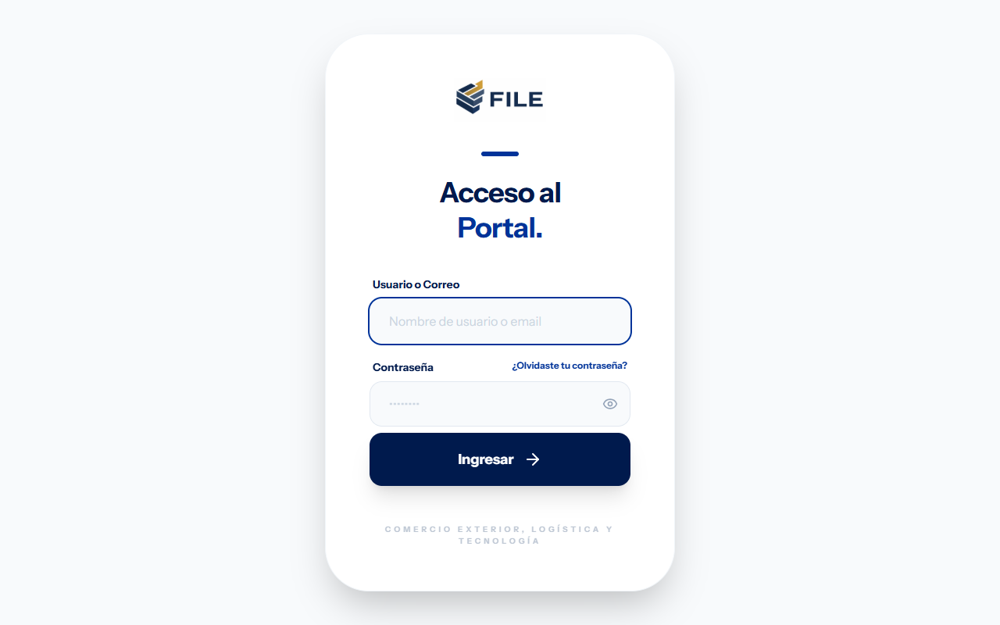

📋 **Qué necesitas:** Una cuenta de correo electrónico registrada en el sistema y acceso a internet.

### 2.2 Mi Perfil y Preferencias
Al acceder a la sección **"Mi Perfil"** (en el menú superior derecho), usted puede:
* Actualizar sus datos personales (Nombre completo, Teléfono).
* Modificar su contraseña actual.
* **Preferencias Visuales:** Cambiar el tema visual de la interfaz. La aplicación cuenta con tres modalidades de color premium adaptativas:
  * **Modo Claro (Light Mode):** Alta legibilidad con tonos blancos y slate limpios.
  * **Modo Oscuro (Dark Mode):** Interfaz relajante para el uso nocturno con contrastes optimizados.
  * **Tema del Sistema:** Se adapta automáticamente a la configuración visual de su sistema operativo.

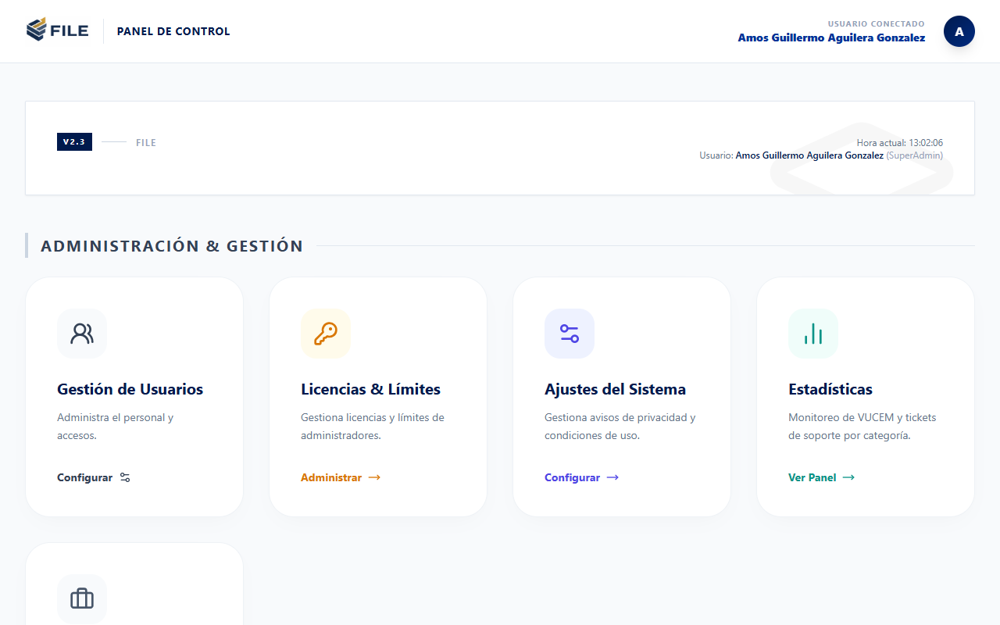

---

# 3. Gestión de Solicitantes y Carga de e.firma

Antes de comenzar a capturar declaraciones MVE, debe dar de alta al **Solicitante** (la persona física o moral que exporta las mercancías).

### 3.1 Alta de un Solicitante
1. Diríjase al menú izquierdo y seleccione **"Solicitantes"**.
2. Haga clic en **"Crear Solicitante"**.
3. Rellene los campos obligatorios:
   * **Razón Social:** Nombre comercial o denominación legal de la empresa.
   * **RFC del Solicitante:** Clave del Registro Federal de Contribuyentes (12 caracteres para personas morales, 13 para personas físicas).

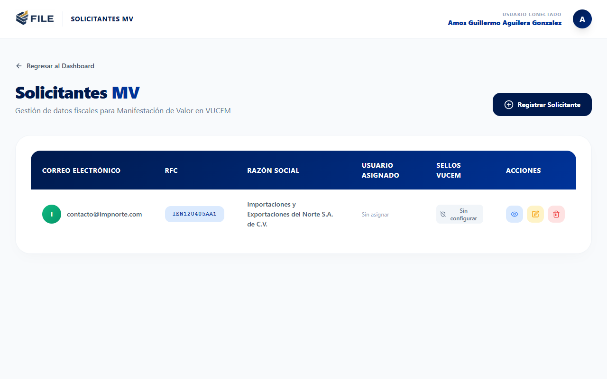

### 3.2 Carga y Configuración de la e.firma (FIEL)
VUCEM exige que todas las manifestaciones y digitalizaciones se firmen con la e.firma (antes FIEL) vigente del contribuyente solicitante.

1. En el perfil del solicitante creado, ubique la sección **"Configurar e.firma"**.
2. Suba los siguientes archivos:
   * **Certificado Público (`.cer`):** Archivo con la llave pública de la empresa.
   * **Llave Privada (`.key`):** Archivo que contiene la clave de cifrado privada.
   * **Contraseña de la Llave:** La contraseña correspondiente a su e.firma.
3. **Seguridad:** El sistema cifra de manera simétrica y segura la contraseña de la FIEL antes de almacenarla en la base de datos (utilizando el algoritmo AES-256-CBC con claves exclusivas del servidor), garantizando que nadie pueda extraer sus contraseñas.

⚠️ **Nota:** Asegúrese de que su certificado de e.firma esté vigente ante el SAT. Si el certificado ha caducado, los web services de VUCEM rechazarán automáticamente los envíos mostrando un error de autenticación.

### 3.3 Credenciales y Token Web Service de VUCEM
Para realizar consultas en tiempo real y descarga de COVEs directamente desde el SAT, es necesario registrar los accesos web service provistos por VUCEM:
* **Web Services Key / Contraseña de VUCEM:** Código de autenticación que proporciona el portal de VUCEM para desarrollo y consumo del API.
* **RFC del Agente Aduanal / Mandatario:** Utilizado cuando se delegan facultades de consulta.

✅ **Resultado:** Una vez configurado el solicitante y su e.firma, el estatus en pantalla cambiará a **"Operando"** (con check verde), indicando que el solicitante está listo para firmar y transmitir.

---

# 4. Creación de Manifestación de Valor (MVE)

El sistema ofrece dos vías para generar una Manifestación de Valor. Puede hacer la captura en un formulario interactivo paso a paso o automatizar el llenado cargando un archivo de pedimento (Archivo M).

---

## 4.1 Método 1: Captura Manual Paso a Paso

Al ingresar a **"Crear MVE"** y seleccionar el solicitante, el asistente dinámico (stepper) lo guiará a través de 5 secciones consecutivas. El sistema guarda borradores parciales en cada paso de manera automática para evitar pérdidas de información ante desconexiones.

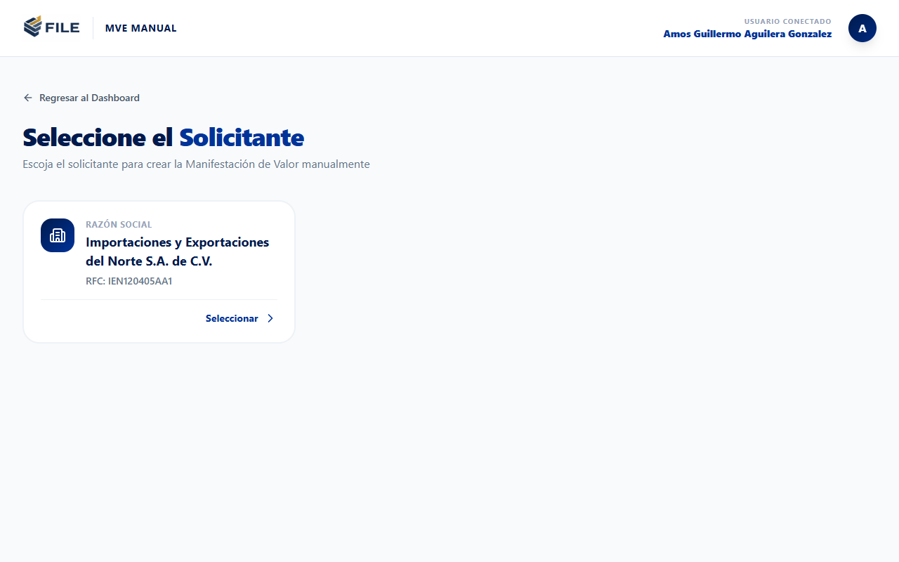

### Paso 1: Datos de Manifestación
* **Pedimento, Patente y Aduana:** Claves de 7, 4 y 3 dígitos respectivamente que identifican la operación aduanera.
* **RFC del Agente Aduanal:** Identificador tributario del agente aduanal que valida el pedimento.
* **Tipo de Cambio:** Tipo de cambio aplicable a la fecha de pago de la operación.
* **Persona que Consulta:** Registro de los RFC autorizados para consultar el trámite (ej. mandatarios, representantes).

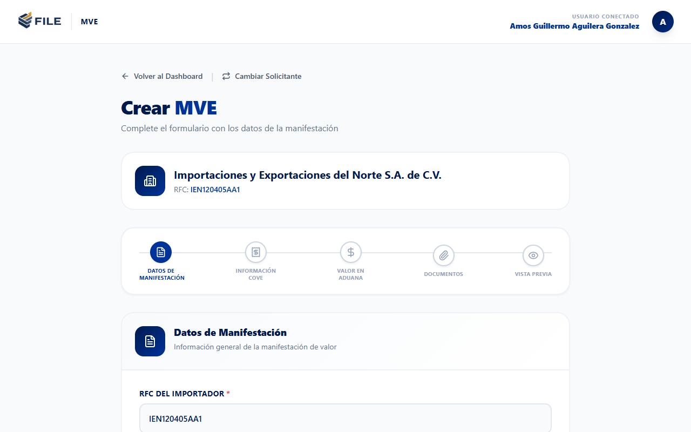

🔁 **Siguiente paso:** Guarde la información y avance al Paso 2 ("Información COVE").

---

### Paso 2: Información COVE
En esta sección se listan y asocian todos los Comprobantes de Valor Electrónico (COVEs) que amparan las mercancías de la exportación.

1. **Agregar eDocument:** Capture el código alfanumérico de 13 caracteres de su eDocument del COVE y pulse **"Buscar Info COVE"**.
2. **Extracción Automática:** El sistema conectará de forma transparente con VUCEM, importará los datos del COVE y desglosará automáticamente en tablas:
   * **Facturas Relacionadas:** Números de factura, fechas y monedas de facturación.
   * **Incrementables:** Conceptos adicionales pagados en el extranjero (fletes, seguros, embalajes, regalías) desglosados en moneda extranjera y nacional.
   * **Decrementables:** Conceptos disminuidos del precio pagado (fletes nacionales, gastos de construcción posteriores, etc.).

> 💡 **Consejo:** Puede asociar múltiples eDocuments de COVE a una sola Manifestación de Valor si las mercancías provienen de diferentes facturas o comprobantes del mismo exportador.

---

### Paso 3: Valor en Aduana
En esta sección se consolida el desglose financiero de la operación.
* El sistema presenta una tabla comparativa con los precios pagados y las monedas originales de cada COVE.
* Se calcula de forma automática el **Valor de Aduana Consolidado (en Pesos Mexicanos)** multiplicando las divisas por el Tipo de Cambio guardado en el Paso 1, sumando los incrementables y restando los decrementables aplicables.
* El usuario debe validar que estas sumas coincidan perfectamente con los valores declarados en su pedimento para evitar multas.

---

### Paso 4: Documentos Adjuntos
Aquí deberá anexar las facturas de comercio exterior, contratos u otros comprobantes que justifiquen el valor declarado.

1. **Subir Documento:** Seleccione el archivo PDF local.
2. **Validación Automática de VUCEM:** El sistema no permite la subida de archivos corruptos o incompatibles. Ejecuta una auditoría que verifica:
   * **Estándar PDF/A-1b:** Requisito indispensable de VUCEM. Si el archivo no es compatible, el sistema intentará convertirlo automáticamente en segundo plano mediante un pipeline con Ghostscript.
   * **Optimización:** Ajuste de resolución y conversión a escala de grises para asegurar que el archivo final no exceda los límites de peso de VUCEM.
3. **Estatus de Validación:** Si el archivo pasa los filtros, aparecerá con la etiqueta **"Válido VUCEM"** en color azul.

---

### Paso 5: Vista Previa y Verificación
* Se muestra una ficha de resumen completa con todos los datos capturados.
* Si falta algún campo obligatorio en los pasos anteriores, la pantalla mostrará una advertencia roja indicando qué sección debe ser corregida.
* Si toda la información es correcta, el botón **"Confirmar y Guardar"** quedará habilitado, cambiando el estatus de la manifestación de **"Borrador"** a **"Guardado"** en su bandeja de pendientes.

---

## 4.2 Método 2: Importación mediante Archivo M de Pedimento

Si ya cuenta con el archivo de pedimento generado por su sistema de tráfico (el archivo plano con extensión de texto comúnmente llamado **"Archivo M"**), puede cargar el archivo para llenar el 90% de la MVE en segundos.

1. Al dar clic en **"Crear MVE"**, elija la opción **"Importar Archivo M"**.
2. Suba el archivo plano.
3. **Parseo Automático:** El sistema leerá la estructura de registros de longitud fija:
   * **Registro 500 (Datos Generales):** Extrae patente, pedimento, aduana, tipo de cambio y fecha de pago.
   * **Registro 501 (Datos del Importador/Exportador):** Valida la correspondencia con el RFC del solicitante.
   * **Registro 505 (Facturas):** Obtiene número de factura, fecha, moneda e incoterm.
   * **Registro 506 (Fechas de Pedimento):** Fechas de entrada y pago.
   * **Registro 507 (Casos del Pedimento) y Registros 551 a 556 (Contribuciones e Importes):** Extraen incrementables y decrementables declarados.
4. **Validación:** El sistema generará el borrador del MVE y abrirá la pantalla directamente en el **Paso 5 (Vista Previa)** para que usted revise, adjunte sus facturas y complete el envío.

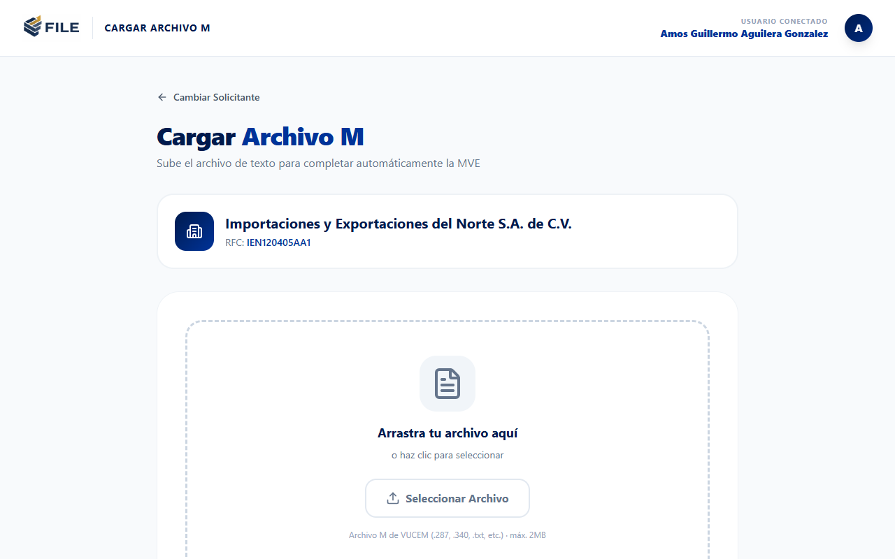

✅ **Resultado:** Ahorro masivo de tiempo en la captura de operaciones con decenas de COVEs o incrementables complejos.

---

# 5. Proceso de Firma Electrónica Avanzada y Envío a VUCEM

Una vez que la Manifestación de Valor tiene estatus **"Guardado"**, está lista para ser enviada formalmente al SAT.

### 5.1 Generación de la Cadena Original
Al iniciar el proceso de firma, la plataforma concatena ordenadamente los datos clave del trámite utilizando pipes como delimitadores (`|`), construyendo la **Cadena Original** oficial (ej. `||PATENTE|PEDIMENTO|FECHA|RFC|VALOR_ADUANA||`).

### 5.2 Firma Criptográfica
1. Se recupera de la base de datos la llave privada cifrada y el certificado del solicitante.
2. El sistema solicita al usuario que ingrese la contraseña de la FIEL (si no la dejó guardada en la base de datos).
3. Se genera la firma digital (SHA-256 con RSA) sobre la cadena original.
4. Se envuelve el resultado en un sobre XML con estructura SOAP que incluye los tokens de seguridad de Web Services Security (WSSE).

### 5.3 Transmisión Asíncrona (AJAX)
1. Al presionar **"Firmar y Enviar"**, la petición se procesa en el servidor de forma asíncrona.
2. Mientras se realiza la conexión con el servidor SOAP de VUCEM, el usuario verá un indicador visual de carga sin necesidad de recargar la página.
3. El sistema monitorea la respuesta:
   * **Transmisión Exitosa:** VUCEM acepta el trámite, genera el sello digital y el sistema recibe el **Número de Manifestación de Valor (MV)**. El estatus cambia a **"Enviado"** / **"Completado"**.
   * **Rechazo Técnico:** Si hay algún error en los datos (ej. un eDocument inexistente o RFC desalineado), VUCEM responderá con un error SOAP. El sistema captura este error, lo despliega en pantalla y cambia el estatus a **"Rechazado"** para que pueda ser editado y corregido inmediatamente.

---

# 6. Bandejas de Control e Historial (Pendientes y Completadas)

La plataforma organiza sus trámites en dos grandes bandejas accesibles desde el menú superior o el panel de control:

### 6.1 MVE Pendientes
* **Contenido:** Contiene las manifestaciones en estatus `Borrador`, `Guardado` o `Rechazado`.
* **Acciones:**
  * **Editar:** Continuar con la captura en el stepper.
  * **Firmar y Enviar:** Iniciar el proceso de envío a VUCEM.
  * **Eliminar:** Descartar definitivamente la manifestación si la operación ya no se llevará a cabo.

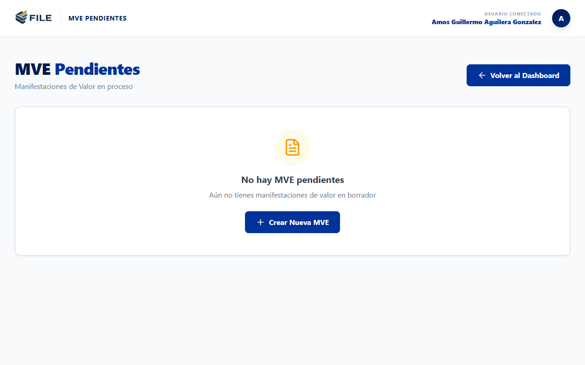

### 6.2 MVE Completadas
* **Contenido:** Lista histórica de todas las MVE enviadas con éxito a VUCEM y que cuentan con un número de folio asignado por el SAT.
* **Descarga de Acuses:** Para cada MVE completada, usted puede descargar:
  * **Acuse PDF:** El documento de acuse oficial sellado por el SAT con el código de barras bidimensional.
  * **Declaración XML:** El archivo XML completo que contiene la información estructurada que se envió a VUCEM.
  * **Acuse XML:** La firma digital de recepción emitida por los servidores del SAT en formato XML.

---

# 7. Módulo de Consulta de COVEs

Si desea validar la información de un COVE en particular o recuperar su acuse oficial sin necesidad de crear una Manifestación de Valor, puede usar la herramienta de consulta directa:

1. Diríjase a **"Consulta de COVE"** en la barra lateral.
2. Seleccione el Solicitante (para que la plataforma use sus credenciales VUCEM autorizadas).
3. Introduzca el **eDocument** del COVE.
4. Presione **"Consultar VUCEM"**.
5. **Acciones Disponibles:**
   * **Descargar XML del COVE:** Descarga la estructura técnica del comprobante.
   * **Descargar Acuse PDF:** Obtiene la representación impresa del acuse de valor directo del SAT.

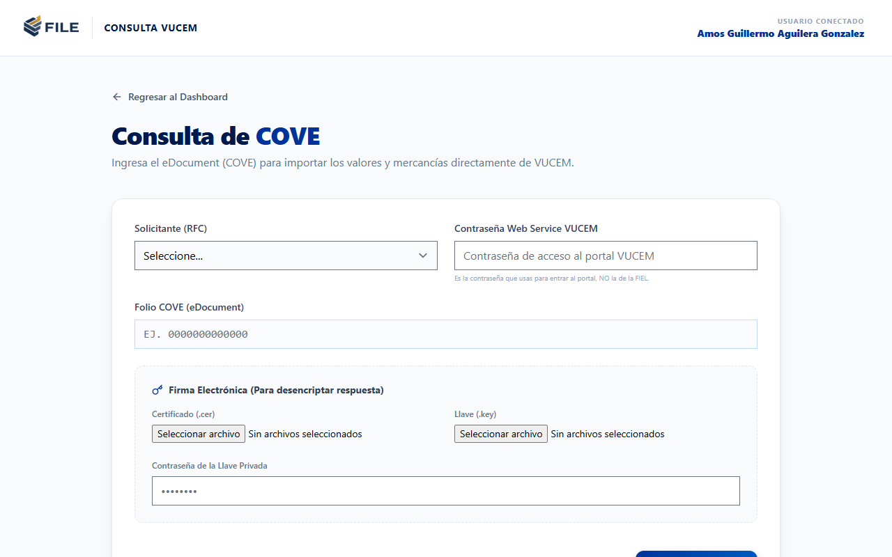

📋 **Qué necesitas:** El eDocument del COVE a consultar y que el solicitante seleccionado tenga dadas de alta sus credenciales webservice VUCEM válidas.

---

# 8. Módulo de Digitalización de Documentos

La digitalización es el trámite mediante el cual se sube un documento PDF (ej. un certificado de origen, una carta de cupo o una factura no comercial) al repositorio de VUCEM para obtener un identificador electrónico (**eDocument**), indispensable para declararlo en el pedimento aduanal.

1. Vaya a **"Digitalización VUCEM"** en el menú.
2. Suba el documento PDF.
3. El sistema verificará de forma obligatoria que el PDF sea compatible con el estándar **PDF/A-1b** y no supere los límites de tamaño. De ser necesario, aplicará la optimización con Ghostscript de manera automática.
4. Firme el archivo con su e.firma.
5. Presione **"Transmitir Digitalización"**.
6. **Consultar Estado:** A diferencia de las MVE, las digitalizaciones en VUCEM pueden tardar unos minutos en procesarse. El sistema provee un botón para **"Consultar Número de Operación"** que le permite verificar si el eDocument final ya está listo para ser copiado.

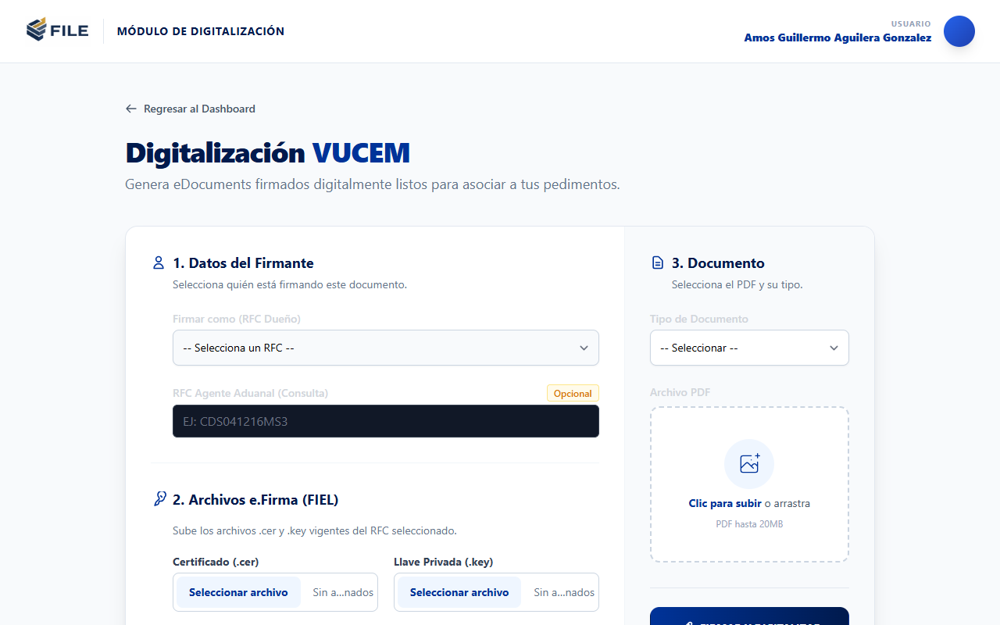

✅ **Resultado:** Obtención del eDocument del documento digitalizado para su posterior uso en pedimentos.

---

# 9. Preguntas Frecuentes (FAQs) y Tickets de Soporte

El sistema ofrece herramientas integradas para solucionar dudas técnicas y reportar problemas operacionales sin salir de la plataforma.

### 9.1 Centro de FAQs
* Acceda a **"Preguntas Frecuentes"** en el menú superior.
* Busque por temas comunes como: "Errores de firma con FIEL", "Cómo recuperar el eDocument", "Configuración de Ghostscript", etc.
* Los administradores pueden adjuntar documentos guía (PDF, imágenes) a estas preguntas para detallar procedimientos.

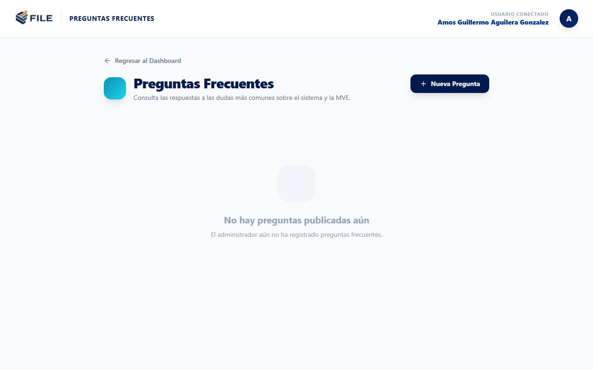

### 9.2 Mesa de Ayuda (Tickets de Soporte)
Si experimenta un error persistente en un envío SOAP o tiene problemas con las credenciales de un solicitante:
1. Vaya a **"Tickets de Soporte"**.
2. Haga clic en **"Crear Ticket"**.
3. Describa detalladamente el problema y asigne una prioridad (Baja, Media, Alta, Crítica).
4. **Adjuntos de Soporte:** Puede subir capturas de pantalla o, mejor aún, el archivo de logs que genera el sistema para que el equipo de desarrollo pueda identificar la falla técnica rápidamente.
5. El estatus del ticket cambiará de `Abierto` a `En Proceso`, `Respondido` o `Cerrado` conforme reciba atención técnica.

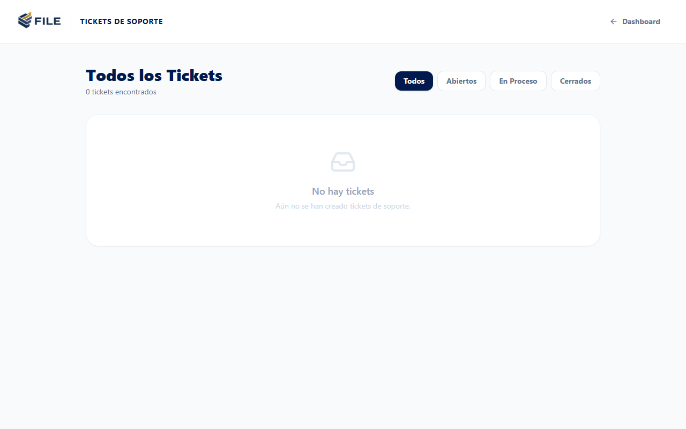

---

# 10. Administración y Configuración del Sistema

Estas funciones están reservadas para usuarios con roles administrativos (**Admin** y **SuperAdmin**).

### 10.1 Gestión de Usuarios
* **Ruta:** Menú Superior > Ajustes > **Gestión de Usuarios**.
* **Acciones:** Dar de alta nuevos operadores, modificar correos, suspender cuentas y asignar qué usuarios tienen permiso para visualizar o firmar operaciones de solicitantes específicos.
* **Roles disponibles:**
  * **SuperAdmin:** Acceso absoluto al sistema, estadísticas de uso globales, licencias y parámetros generales del servidor.
  * **Admin:** Administra la empresa, gestiona los solicitantes (RFCs) asignados a su organización y controla las cuentas de los operadores/usuarios de su equipo.
  * **Usuario (Operador):** Solo puede capturar, firmar y consultar MVEs de los solicitantes a los que le haya sido otorgado acceso.

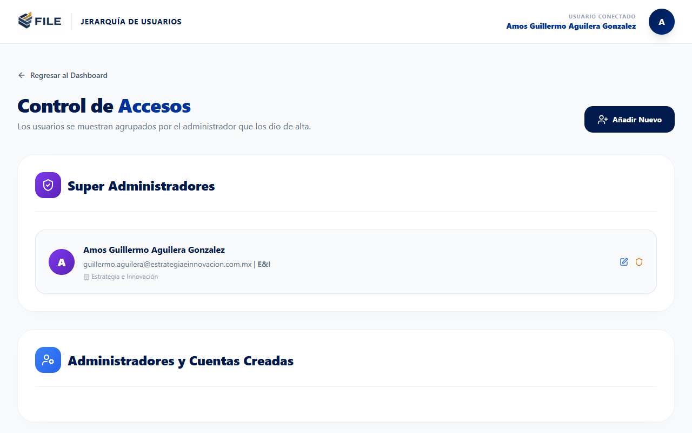

### 10.2 Control de Licencias e Historial de Operaciones
El sistema opera bajo un modelo de suscripción basado en límites de transmisiones mensuales.
* En **"Gestión de Licencias"**, el SuperAdmin puede dar de alta nuevas licencias asignando un RFC titular, una fecha de vigencia y un número límite de firmas/digitalizaciones al mes (ej. 500 transmisiones).
* Si una empresa agota su límite de firmas, los usuarios no podrán realizar nuevos envíos SOAP a VUCEM hasta que el administrador renueve o amplíe la licencia. El sistema mostrará una advertencia clara en el dashboard.

### 10.3 Ajustes Generales de la Aplicación
El SuperAdmin puede modificar los siguientes parámetros en caliente:
* **Aviso de Privacidad y Términos de Servicio:** Textos legales que se muestran a los usuarios en las páginas públicas y durante el registro.
* **Avisos Generales (Banners):** Mensajes informativos de alta prioridad (ej. *"Mantenimiento programado de VUCEM hoy a las 20:00 hrs"*) que se muestran en el encabezado del dashboard de todos los usuarios activos.

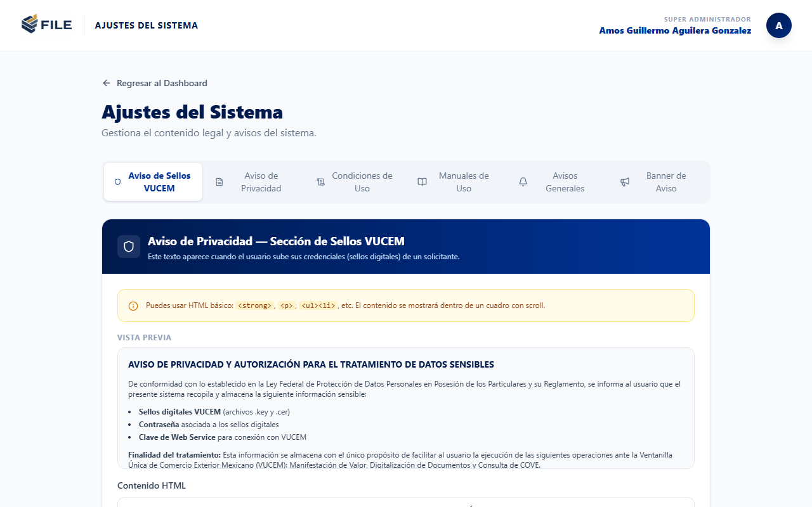
